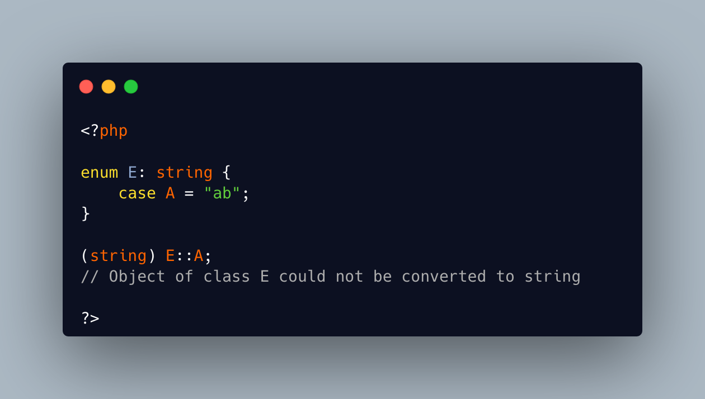

.. _casting-an-enum-case:

Casting An Enum Case
--------------------

.. meta::
	:description:
		Casting An Enum Case: TIL that enumeration cases cannot be cast.
	:twitter:card: summary_large_image
	:twitter:site: @exakat
	:twitter:title: Casting An Enum Case
	:twitter:description: Casting An Enum Case: TIL that enumeration cases cannot be cast
	:twitter:creator: @exakat
	:twitter:image:src: https://php-tips.readthedocs.io/en/latest/_images/casting_enum.png
	:og:image: https://php-tips.readthedocs.io/en/latest/_images/casting_enum.png
	:og:title: Casting An Enum Case
	:og:type: article
	:og:description: TIL that enumeration cases cannot be cast
	:og:url: https://php-tips.readthedocs.io/en/latest/tips/casting_enum.html
	:og:locale: en

.. raw:: html

	

TIL that enumeration cases cannot be cast. They can't be to a boolean, because they are an object.

They can't be cast to their scalar value (``int`` or ``string``), even though it looks reasonable to do.

Of course, they can be cast to array (they are simply put inside an array), or to an object (nothing happens).

See Also
________

* `Cannot Cast Enum <https://3v4l.org/G5aLS>`_ [Try me]

PHP Error Messages
__________________

* `Object of class E could not be converted to string <https://php-errors.readthedocs.io/en/latest/messages/object-of-class-%25s-could-not-be-converted-to-string.html>`_

PHP Features
____________

* `enum <https://php-dictionary.readthedocs.io/en/latest/dictionary/enum.ini.html>`_

* `enum-case <https://php-dictionary.readthedocs.io/en/latest/dictionary/enum-case.ini.html>`_

* `cast <https://php-dictionary.readthedocs.io/en/latest/dictionary/cast.ini.html>`_

