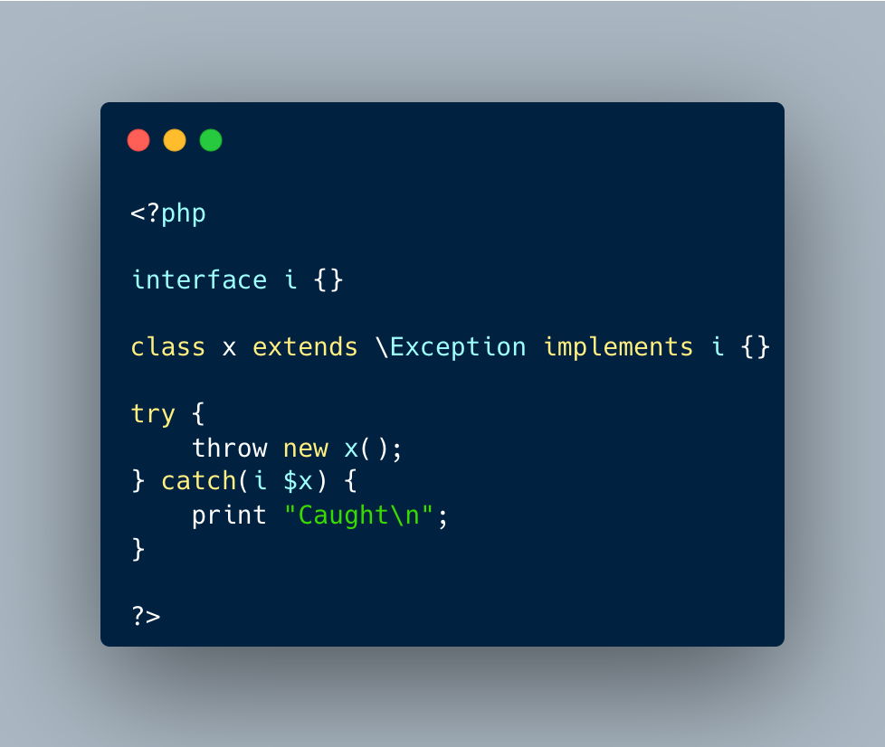

.. _catch-on-interfaces:

Catch On Interfaces
-------------------

.. meta::
	:description:
		Catch On Interfaces: It is possible to catch exceptions based on their interfaces.
	:twitter:card: summary_large_image
	:twitter:site: @exakat
	:twitter:title: Catch On Interfaces
	:twitter:description: Catch On Interfaces: It is possible to catch exceptions based on their interfaces
	:twitter:creator: @exakat
	:twitter:image:src: https://php-tips.readthedocs.io/en/latest/_images/catch_interfaces.png.png
	:og:image: https://php-tips.readthedocs.io/en/latest/_images/catch_interfaces.png
	:og:title: Catch On Interfaces
	:og:type: article
	:og:description: It is possible to catch exceptions based on their interfaces
	:og:url: https://php-tips.readthedocs.io/en/latest/tips/catch_interfaces.html
	:og:locale: en

It is possible to catch exceptions based on their interfaces. That means polymorphism for exceptions.

* `Exceptions (PHP manual) <https://www.php.net/manual/en/language.exceptions.php>`_

