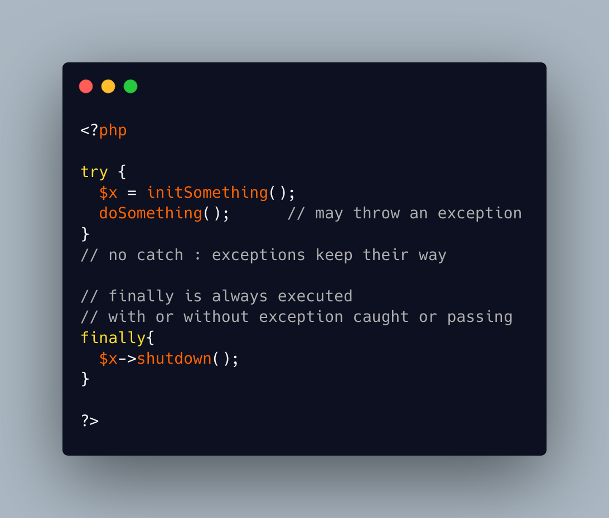

.. _catch-is-optional:

Catch Is Optional
-----------------

.. meta::
	:description:
		Catch Is Optional: In a Try Catch Finally command, only the try part is compulsory.
	:twitter:card: summary_large_image.
	:twitter:site: @exakat.
	:twitter:title: Catch Is Optional.
	:twitter:description: Catch Is Optional: In a Try Catch Finally command, only the try part is compulsory.
	:twitter:creator: @exakat.
	:twitter:image:src: https://php-tips.readthedocs.io/en/latest/_images/catch_is_optional.png.png.
	:og:image: https://php-tips.readthedocs.io/en/latest/_images/catch_is_optional.png.png.
	:og:image: Catch Is Optional: In a Try Catch Finally command, only the try part is compulsory.

In a Try Catch Finally command, only the try part is compulsory. It is possible to create a try command without any catch clause: that way, exceptions are indeed not caught. The finally clause is also optional, but when it is provided, it is always executed, even if exceptions are not caught.

* `Exceptions (PHP manual) <https://www.php.net/manual/en/language.exceptions.php>`_

