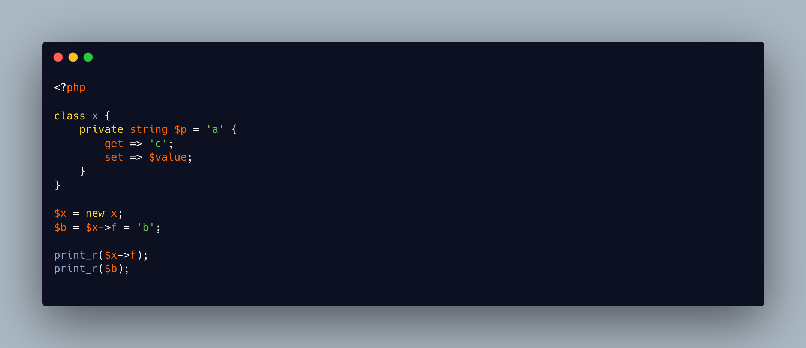

.. _chained-assignation-skips-__get:

Chained Assignation Skips __get()
---------------------------------

.. meta::
	:description:
		Chained Assignation Skips __get(): Chained assignation skip the ``get`` part and assign the same value to all elements in the chain.
	:twitter:card: summary_large_image
	:twitter:site: @exakat
	:twitter:title: Chained Assignation Skips __get()
	:twitter:description: Chained Assignation Skips __get(): Chained assignation skip the ``get`` part and assign the same value to all elements in the chain
	:twitter:creator: @exakat
	:twitter:image:src: https://php-tips.readthedocs.io/en/latest/_images/chained_assignation.png
	:og:image: https://php-tips.readthedocs.io/en/latest/_images/chained_assignation.png
	:og:title: Chained Assignation Skips __get()
	:og:type: article
	:og:description: Chained assignation skip the ``get`` part and assign the same value to all elements in the chain
	:og:url: https://php-tips.readthedocs.io/en/latest/tips/chained_assignation.html
	:og:locale: en

.. raw:: html

	

Chained assignation skip the ``get`` part and assign the same value to all elements in the chain.

When chained assignations are done with variables, the value in the variable is the same as the value out of it: the engine might optimise the work and use the same rightmost value everywhere.

Yet, PHP has dynamic properties, since... a long time ago, and again, with property hooks in PHP 8.4: there, the incoming value may be changed between the ``set`` function and the ``get`` one. Here, the ``get`` is skipped.

In the end, it might be logical, but may also surprise the coder too.

See Also
________

* `Hidden Traps with Chained Assignments <https://www.exakat.io/hidden-traps-with-chained-assignments/>`_
* `Chained surprises <https://3v4l.org/bD8OB#v8.5.7>`_ [Try me]

PHP Features
____________

* `magic-method <https://php-dictionary.readthedocs.io/en/latest/dictionary/magic-method.ini.html>`_

* `property-hook <https://php-dictionary.readthedocs.io/en/latest/dictionary/property-hook.ini.html>`_

* `chaining-assignation <https://php-dictionary.readthedocs.io/en/latest/dictionary/chaining-assignation.ini.html>`_

