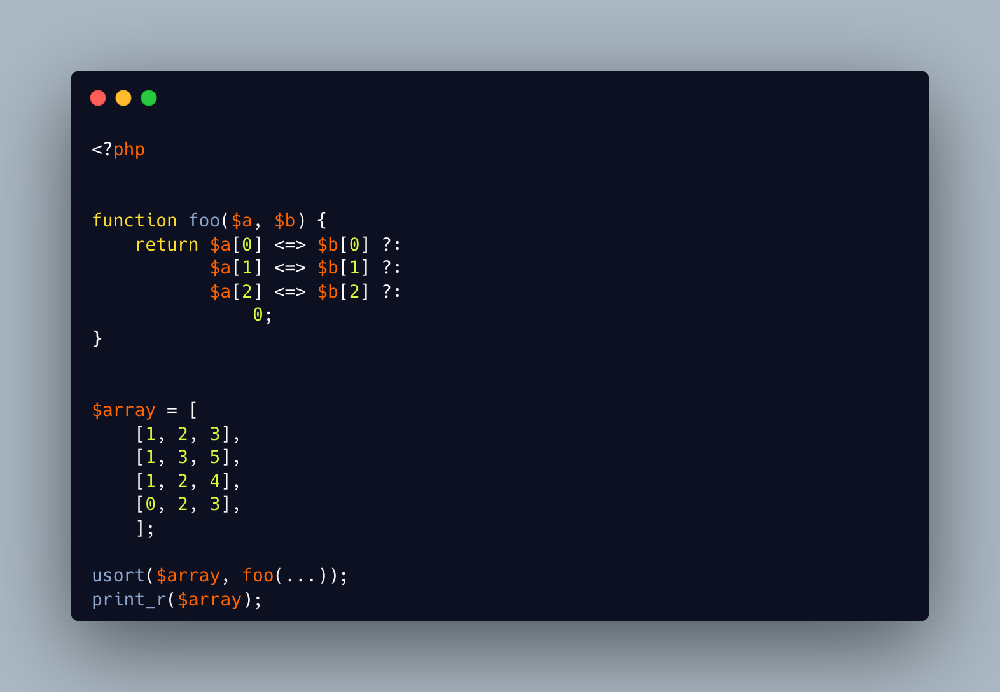

.. _chaining-spaceship:

Chaining Spaceship
------------------

.. meta::
	:description:
		Chaining Spaceship: It is possible to chain several spaceship operations by using the coalesce operator ``.
	:twitter:card: summary_large_image
	:twitter:site: @exakat
	:twitter:title: Chaining Spaceship
	:twitter:description: Chaining Spaceship: It is possible to chain several spaceship operations by using the coalesce operator ``
	:twitter:creator: @exakat
	:twitter:image:src: https://php-tips.readthedocs.io/en/latest/_images/chaining_spaceship.png
	:og:image: https://php-tips.readthedocs.io/en/latest/_images/chaining_spaceship.png
	:og:title: Chaining Spaceship
	:og:type: article
	:og:description: It is possible to chain several spaceship operations by using the coalesce operator ``
	:og:url: https://php-tips.readthedocs.io/en/latest/tips/chaining_spaceship.html
	:og:locale: en

.. raw:: html

	

It is possible to chain several spaceship operations by using the coalesce operator ``?:``. When the first spaceship operator returns 1 or -1, its value is immediately used. On the other hand, when the operation leads to 0, the coalesce ``?:`` uses the else branch, where the second spaceship operator is used, to the same effect.

This expression here replaces a call to ``array_multi_sort()``.

And of course, literally chaining spaceships together is a very bad idea.

See Also
________

* `array_multisort (PHP manual) <https://www.php.net/manual/en/function.array-multisort.php>`_
* `chaining spaceships <https://3v4l.org/8C5Xd>`_ [Try me]

PHP Features
____________

* `spaceship <https://php-dictionary.readthedocs.io/en/latest/dictionary/spaceship.ini.html>`_

* `coalesce <https://php-dictionary.readthedocs.io/en/latest/dictionary/coalesce.ini.html>`_

