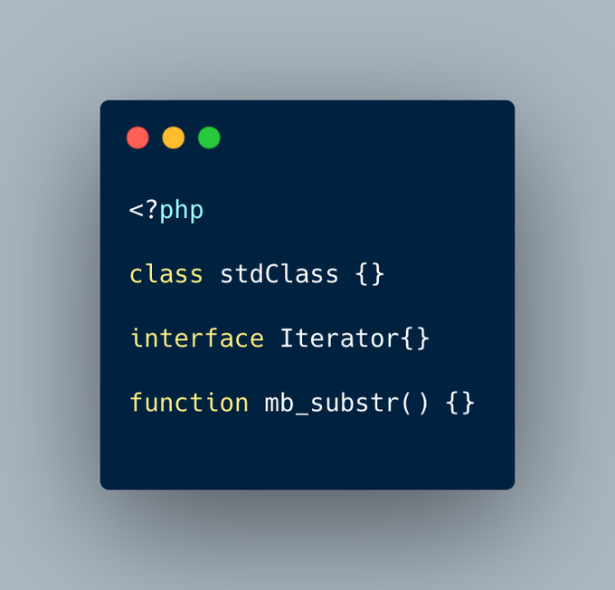

.. _checking-for-names-at-different-times:

Checking For Names At Different Times
-------------------------------------

.. meta::
	:description:
		Checking For Names At Different Times: PHP lint detects early to avoid ``redeclared functions``, based on the local PHP executable.
	:twitter:card: summary_large_image
	:twitter:site: @exakat
	:twitter:title: Checking For Names At Different Times
	:twitter:description: Checking For Names At Different Times: PHP lint detects early to avoid ``redeclared functions``, based on the local PHP executable
	:twitter:creator: @exakat
	:twitter:image:src: https://php-tips.readthedocs.io/en/latest/_images/check_for_names.png
	:og:image: https://php-tips.readthedocs.io/en/latest/_images/check_for_names.png
	:og:title: Checking For Names At Different Times
	:og:type: article
	:og:description: PHP lint detects early to avoid ``redeclared functions``, based on the local PHP executable
	:og:url: https://php-tips.readthedocs.io/en/latest/tips/check_for_names.html
	:og:locale: en

.. raw:: html

	

PHP lint detects early to avoid ``redeclared functions``, based on the local PHP executable.

``php -l => Cannot redeclare mb_substr()``.

That detection doesn't apply to CITE until execution.

``php => Cannot declare class stdClass``

because the name is already in use``. This is a difference in processing similar information, which may cause late surprises.

See Also
________

* `When to check for name <https://3v4l.org/eT5rs>`_ [Try me]

PHP Features
____________

* `class <https://php-dictionary.readthedocs.io/en/latest/dictionary/class.ini.html>`_

* `function <https://php-dictionary.readthedocs.io/en/latest/dictionary/function.ini.html>`_

* `cite <https://php-dictionary.readthedocs.io/en/latest/dictionary/cite.ini.html>`_

