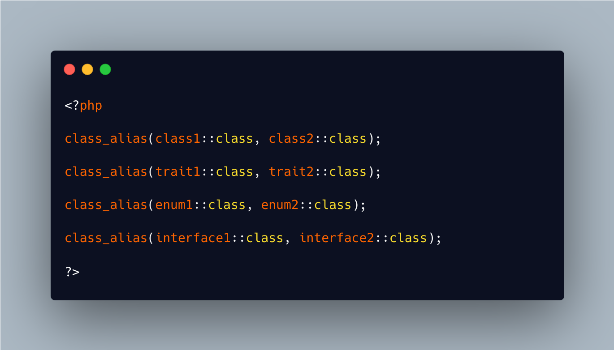

.. _all-classes-aliases:

All Classes Aliases
-------------------

.. meta::
	:description:
		All Classes Aliases: To make a class alias, use class_alias().
	:twitter:card: summary_large_image
	:twitter:site: @exakat
	:twitter:title: All Classes Aliases
	:twitter:description: All Classes Aliases: To make a class alias, use class_alias()
	:twitter:creator: @exakat
	:twitter:image:src: https://php-tips.readthedocs.io/en/latest/_images/class_alias_alias.png.png
	:og:image: https://php-tips.readthedocs.io/en/latest/_images/class_alias_alias.png
	:og:title: All Classes Aliases
	:og:type: article
	:og:description: To make a class alias, use class_alias()
	:og:url: https://php-tips.readthedocs.io/en/latest/tips/class_alias_alias.html
	:og:locale: en

To make a class alias, use class_alias();

To make an interface alias, use class_alias();

To make an enum alias, use class_alias();

To make a trait alias, use class_alias();

Also, there is no ``::enum`` operator, ``::trait`` operator or ``::interface`` operator, so you can just just ``::class``

In the end, they all share the same name space.

* `class_alias (PHP manual) <https://www.php.net/class_alias>`_

