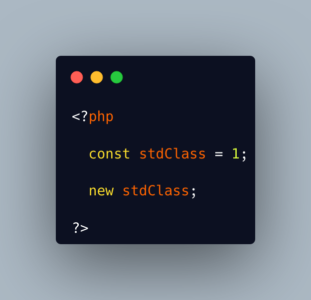

.. _class-and-constant-confusion:

Class And Constant Confusion
----------------------------

	.. meta::
		:description lang=en:
			Class And Constant Confusion: Class names and global constant names are two distinct name spaces.

Class names and global constant names are two distinct name spaces. It is possible to use the name of a class as a constant.

It is also possible to instanciate a class with a constant notation: that is, by omitting the parenthesis in the new call, when no arguments are needed.

This allows for very confusing lines like these ones.

* `Class Constants (PHP manual) <https://www.php.net/manual/en/language.oop5.constants.php>`_

