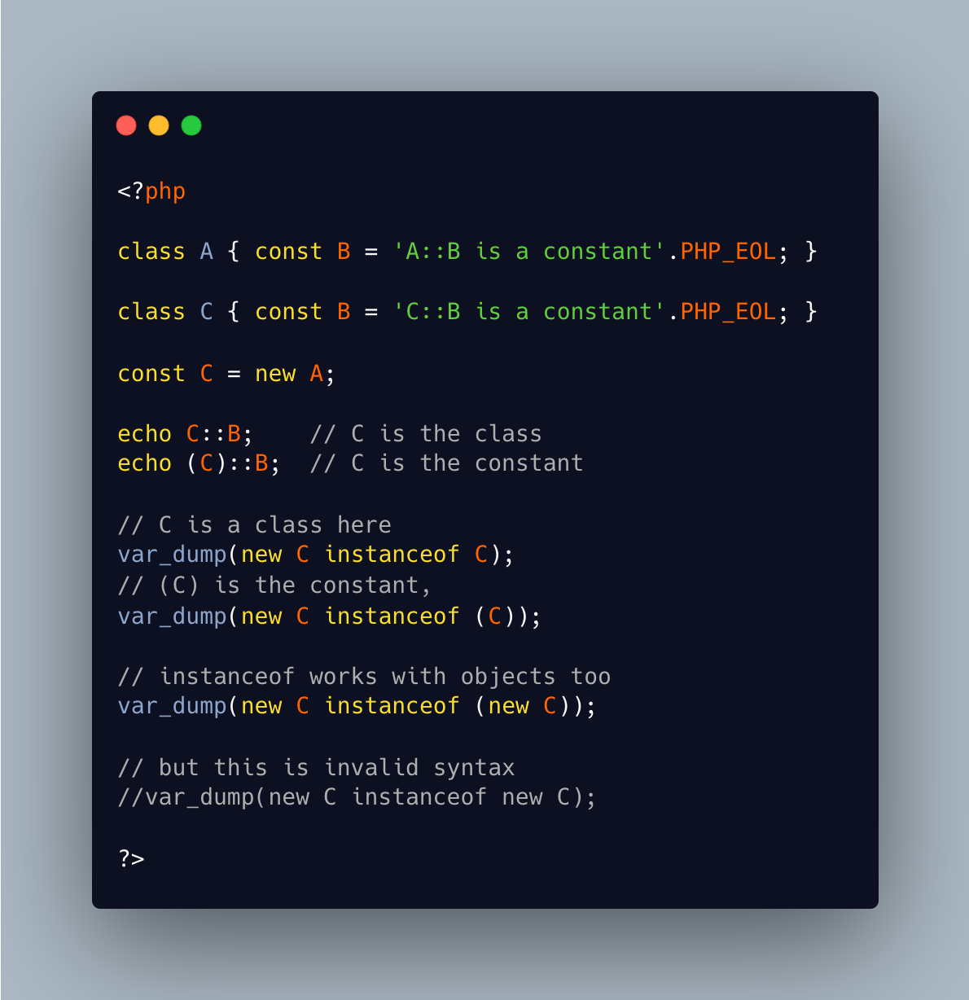

.. _confusion-between-class-and-const:

Confusion Between Class And Const
---------------------------------

.. meta::
	:description:
		Confusion Between Class And Const: The ``::`` operator works both on class names, and constants.
	:twitter:card: summary_large_image
	:twitter:site: @exakat
	:twitter:title: Confusion Between Class And Const
	:twitter:description: Confusion Between Class And Const: The ``::`` operator works both on class names, and constants
	:twitter:creator: @exakat
	:twitter:image:src: https://php-tips.readthedocs.io/en/latest/_images/class_const_confusion.png
	:og:image: https://php-tips.readthedocs.io/en/latest/_images/class_const_confusion.png
	:og:title: Confusion Between Class And Const
	:og:type: article
	:og:description: The ``::`` operator works both on class names, and constants
	:og:url: https://php-tips.readthedocs.io/en/latest/tips/class_const_confusion.html
	:og:locale: en

.. raw:: html

	

The ``::`` operator works both on class names, and constants. The later is a mix of PHP evolution: first, PHP 8.0 allowed ``::class`` on variables, and then PHP 8.2 allowed constants to hold objects.

This means that the left operand of ``::`` may be a class name, or a constant. And there are two different namespaces for constants and classes, so code may hold both a class ``A`` and a constant ``A``.

In case of ambiguity, the class has priority over the constant. ``A::class`` is the name of the class, not the name of the class of the constant's value.

And, at the same time, when there is only a constant, it's value is used as a base.

For disambiguation purposes, parenthesis are your friends.

See Also
________

* `Class Constant Confusion <https://3v4l.org/IUG8L>`_

