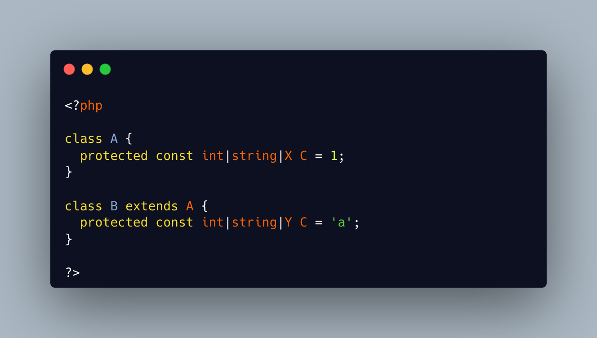

.. _class-constants-with-different-types:

Class Constants With Different Types
------------------------------------

.. meta::
	:description:
		Class Constants With Different Types: With PHP, it is possible to have a class constant with different values, between a parent class, and its child class.
	:twitter:card: summary_large_image
	:twitter:site: @exakat
	:twitter:title: Class Constants With Different Types
	:twitter:description: Class Constants With Different Types: With PHP, it is possible to have a class constant with different values, between a parent class, and its child class
	:twitter:creator: @exakat
	:twitter:image:src: https://php-tips.readthedocs.io/en/latest/_images/class_constant_different_types.png
	:og:image: https://php-tips.readthedocs.io/en/latest/_images/class_constant_different_types.png
	:og:title: Class Constants With Different Types
	:og:type: article
	:og:description: With PHP, it is possible to have a class constant with different values, between a parent class, and its child class
	:og:url: https://php-tips.readthedocs.io/en/latest/tips/class_constant_different_types.html
	:og:locale: en

.. raw:: html

	

With PHP, it is possible to have a class constant with different values, between a parent class, and its child class.

Quizz of the day : can you make a class constant with different types ? Optionally different values.

Works on PHP 8.3. Application unknown.

The trick is to use union types, which allows adding new valid types without ascendant compatibility.

See Also
________

* `Class Constants (PHP manual) <https://www.php.net/manual/en/language.oop5.constants.php>`_

