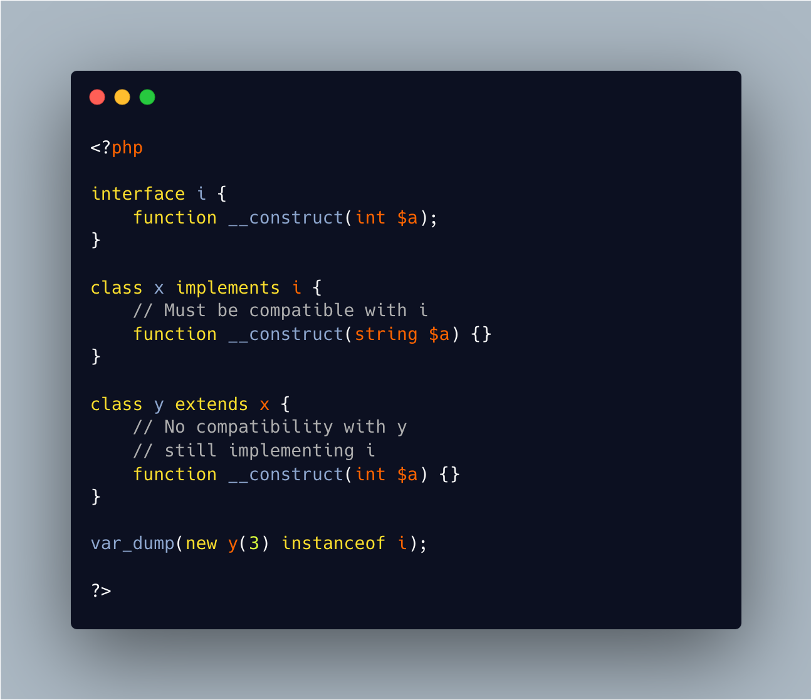

.. _class-implement-no-more:

Class Implement No More
-----------------------

.. meta::
	:description:
		Class Implement No More: Inheritance forces children classes to have only methods that are compatible with the parent's methods.
	:twitter:card: summary_large_image
	:twitter:site: @exakat
	:twitter:title: Class Implement No More
	:twitter:description: Class Implement No More: Inheritance forces children classes to have only methods that are compatible with the parent's methods
	:twitter:creator: @exakat
	:twitter:image:src: https://php-tips.readthedocs.io/en/latest/_images/class_implements_no_more.png
	:og:image: https://php-tips.readthedocs.io/en/latest/_images/class_implements_no_more.png
	:og:title: Class Implement No More
	:og:type: article
	:og:description: Inheritance forces children classes to have only methods that are compatible with the parent's methods
	:og:url: https://php-tips.readthedocs.io/en/latest/tips/class_implements_no_more.html
	:og:locale: en

Inheritance forces children classes to have only methods that are compatible with the parent's methods.

The only exception is the constructor, which may have a totally different signature from generation to generation.

Interfaces apply the same constraints: their methods signature must be compatible with the host class. In this case, it also applies to the constructor.

So, in the case a parent class implements an interface with a constructor, and this class has a child class, the child may look compatible with the interface, and yet, be invalid at the constructor level.

Another good reason to avoid placing constructors in interfaces.

* `Object Interfaces (PHP manual) <https://www.php.net/manual/en/language.oop5.interfaces.php>`_

