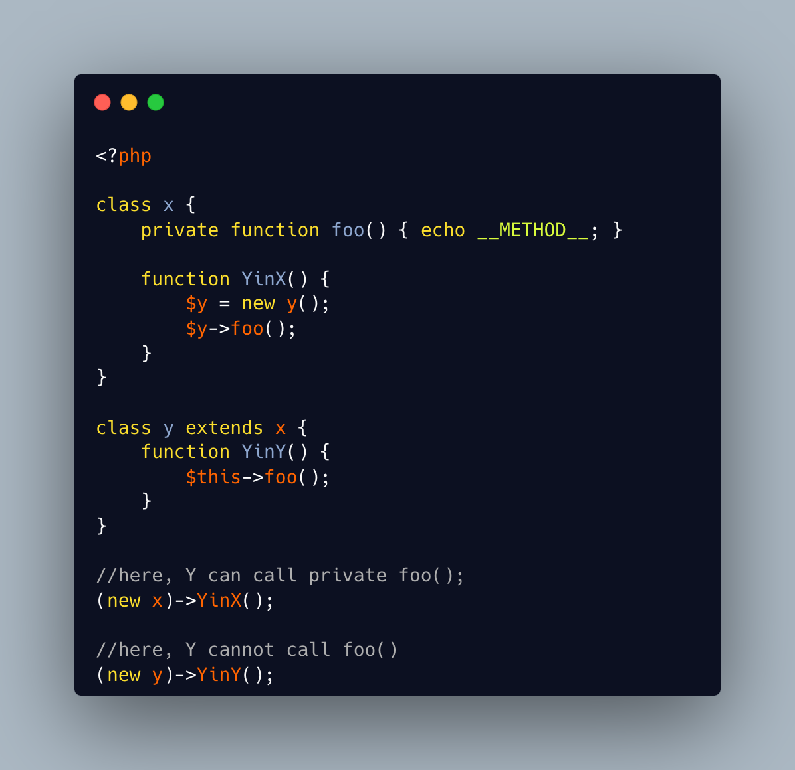

.. _class-invasion-both-ways:

Class Invasion Both Ways
------------------------

.. meta::
	:description:
		Class Invasion Both Ways: Class invasion, it when an object access anything it wants in another object of the same class.
	:twitter:card: summary_large_image
	:twitter:site: @exakat
	:twitter:title: Class Invasion Both Ways
	:twitter:description: Class Invasion Both Ways: Class invasion, it when an object access anything it wants in another object of the same class
	:twitter:creator: @exakat
	:twitter:image:src: https://php-tips.readthedocs.io/en/latest/_images/class_invasion_reciproque.png
	:og:image: https://php-tips.readthedocs.io/en/latest/_images/class_invasion_reciproque.png
	:og:title: Class Invasion Both Ways
	:og:type: article
	:og:description: Class invasion, it when an object access anything it wants in another object of the same class
	:og:url: https://php-tips.readthedocs.io/en/latest/tips/class_invasion_reciproque.html
	:og:locale: en

.. raw:: html

	

Class invasion, it when an object access anything it wants in another object of the same class. Thanks to the way PHP checks each object's perimeter.

The same checks allow the other object to access the current one's, as seen in that example.

See Also
________

* `Class Invasion <https://php-dictionary.readthedocs.io/en/latest/dictionary.html#class-invasion>`_
* `class invasion reciproque <https://3v4l.org/rFjoe>`_

