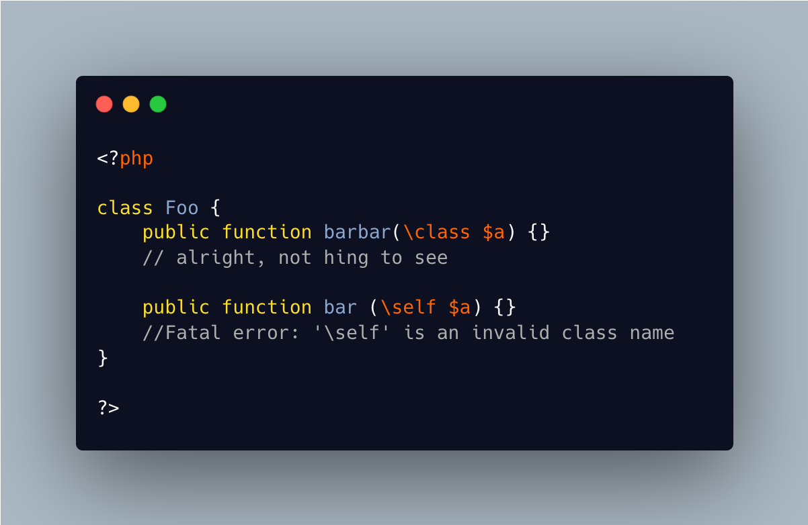

.. _class-is-a-valid-class:

Class Is A Valid Class
----------------------

.. meta::
	:description:
		Class Is A Valid Class: PHP allows to use 'class' as a class name in a type.

PHP allows to use 'class' as a class name in a type. Same for interface, enum, trait... and some others keywords.

A good number of keywords are forbidden, and yield an error : '\self' is an invalid class name.

