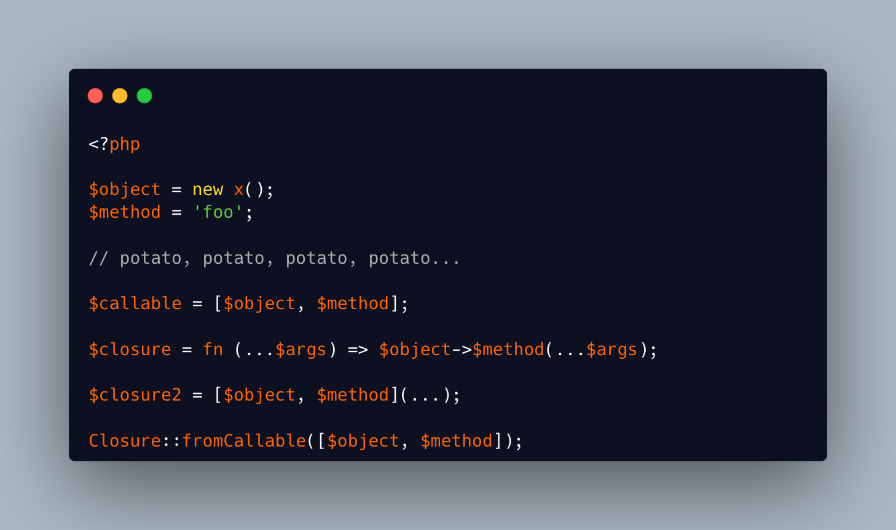

.. _time-of-closure-creation:

Time Of Closure Creation
------------------------

.. meta::
	:description:
		Time Of Closure Creation: Here are four ways to create a closure : a callable array, an arrow function, a first class callable, and a static method.
	:twitter:card: summary_large_image
	:twitter:site: @exakat
	:twitter:title: Time Of Closure Creation
	:twitter:description: Time Of Closure Creation: Here are four ways to create a closure : a callable array, an arrow function, a first class callable, and a static method
	:twitter:creator: @exakat
	:twitter:image:src: https://php-tips.readthedocs.io/en/latest/_images/closureCreation.png
	:og:image: https://php-tips.readthedocs.io/en/latest/_images/closureCreation.png
	:og:title: Time Of Closure Creation
	:og:type: article
	:og:description: Here are four ways to create a closure : a callable array, an arrow function, a first class callable, and a static method
	:og:url: https://php-tips.readthedocs.io/en/latest/tips/closureCreation.html
	:og:locale: en

.. raw:: html

	

Here are four ways to create a closure : a callable array, an arrow function, a first class callable, and a static method. All of them produce the same feature. Here, we focus on the time of checks.

The callable array only collect the variables: the check on these values happen at call time.

The arrow function also collects the values, and report an error only at execution time.

The first class callable checks for the values, reports a failing call to the non-existing method: all this, at definition time. The values must be consistent then.

The static method ``Closure::fromCallable()`` also checks the values at its execution time (not the resulting closure's), and yield a more sensible error message: ``ailed to create closure from callable: class stdClass does not have a method "foo"``.

Which one is your favorite?

See Also
________

* `Potato, potato, potato... <https://3v4l.org/tRUT3>`_ [Try me]

PHP Features
____________

* `closure <https://php-dictionary.readthedocs.io/en/latest/dictionary/closure.ini.html>`_

* `arrow-function <https://php-dictionary.readthedocs.io/en/latest/dictionary/arrow-function.ini.html>`_

* `callable <https://php-dictionary.readthedocs.io/en/latest/dictionary/callable.ini.html>`_

* `array-callable <https://php-dictionary.readthedocs.io/en/latest/dictionary/array-callable.ini.html>`_

