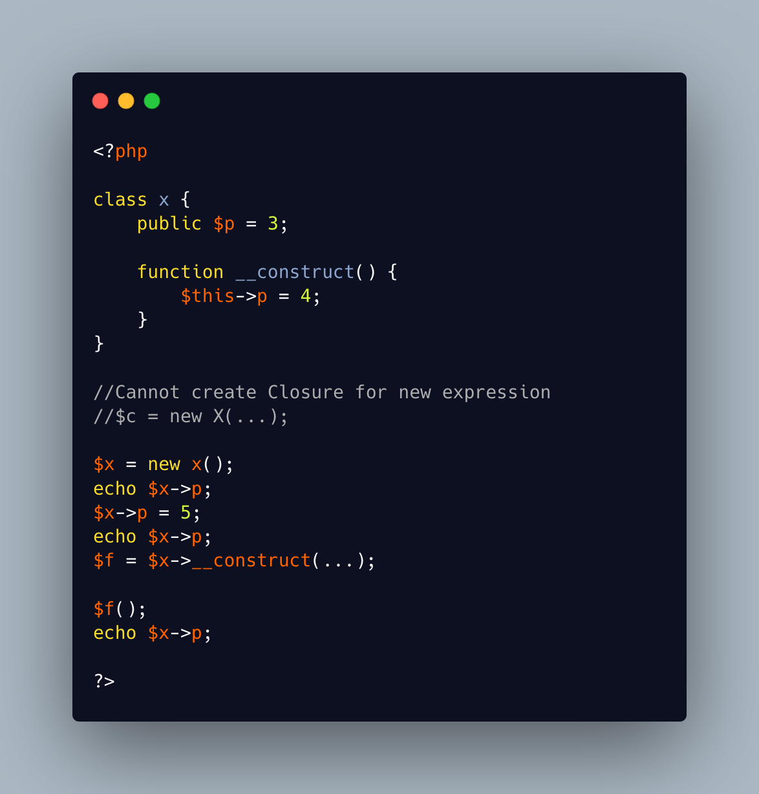

.. _closure-on-constructor:

Closure On Constructor
----------------------

.. meta::
	:description:
		Closure On Constructor: PHP 8.
	:twitter:card: summary_large_image
	:twitter:site: @exakat
	:twitter:title: Closure On Constructor
	:twitter:description: Closure On Constructor: PHP 8
	:twitter:creator: @exakat
	:twitter:image:src: https://php-tips.readthedocs.io/en/latest/_images/closure_on_constructor.png
	:og:image: https://php-tips.readthedocs.io/en/latest/_images/closure_on_constructor.png
	:og:title: Closure On Constructor
	:og:type: article
	:og:description: PHP 8
	:og:url: https://php-tips.readthedocs.io/en/latest/tips/closure_on_constructor.html
	:og:locale: en

.. raw:: html

	

PHP 8.1 introduced first class callable, a syntax to build a closure by using the ellipris operator ``...`` as argument. This works on all sorts of calls, methods, closure, functions.

The only call where it doesn't work is the instantiation: PHP generates an error from that syntax.

On the other hand, it is possible to create a closure on the constructor method, like any other method. And there, it just calls again the constructor, on the object that was already created.

See Also
________

* `Calling the constructor <https://3v4l.org/k57Tp#v8.5.3>`_ [Try me]

PHP Features
____________

* `constructor <https://php-dictionary.readthedocs.io/en/latest/dictionary/constructor.ini.html>`_

* `first-class-callable <https://php-dictionary.readthedocs.io/en/latest/dictionary/first-class-callable.ini.html>`_

* `method <https://php-dictionary.readthedocs.io/en/latest/dictionary/method.ini.html>`_

