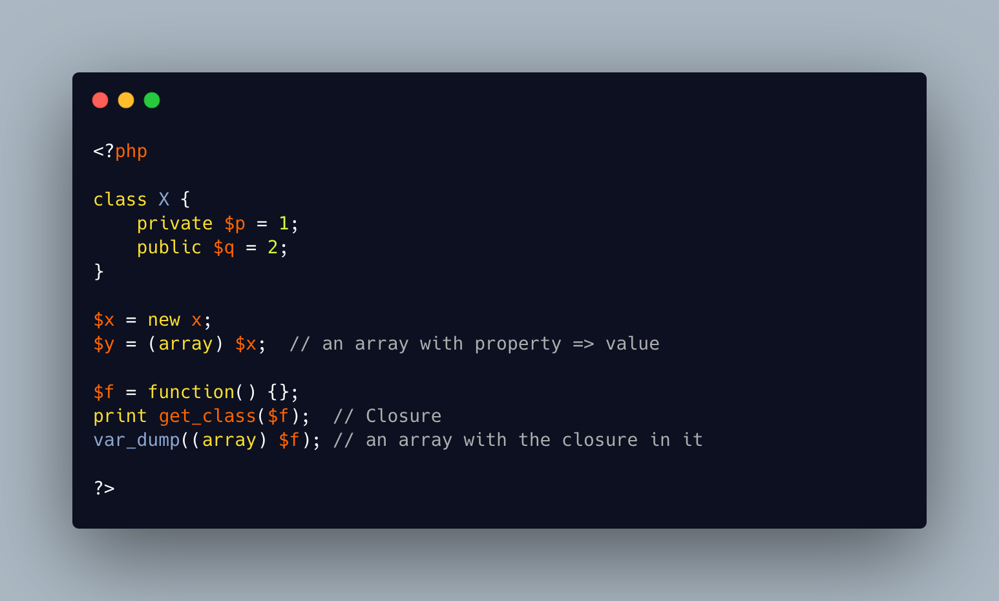

.. _cast-a-closure-to-array:

Cast A Closure To Array
-----------------------

.. meta::
	:description:
		Cast A Closure To Array: TIL: ``(array) $obj`` will result in ``array<string, mixed>`` ( properties key/value pairs ), with the exception if ``$obj`` is Closure, where the result would be ``[$obj]``.
	:twitter:card: summary_large_image
	:twitter:site: @exakat
	:twitter:title: Cast A Closure To Array
	:twitter:description: Cast A Closure To Array: TIL: ``(array) $obj`` will result in ``array<string, mixed>`` ( properties key/value pairs ), with the exception if ``$obj`` is Closure, where the result would be ``[$obj]``
	:twitter:creator: @exakat
	:twitter:image:src: https://php-tips.readthedocs.io/en/latest/_images/closure_to_array.png
	:og:image: https://php-tips.readthedocs.io/en/latest/_images/closure_to_array.png
	:og:title: Cast A Closure To Array
	:og:type: article
	:og:description: TIL: ``(array) $obj`` will result in ``array<string, mixed>`` ( properties key/value pairs ), with the exception if ``$obj`` is Closure, where the result would be ``[$obj]``
	:og:url: https://php-tips.readthedocs.io/en/latest/tips/closure_to_array.html
	:og:locale: en

.. raw:: html

	

By `Saif Eddin Gmati <https://github.com/azjezz>`_

TIL: ``(array) $obj`` will result in ``array<string, mixed>`` ( properties key/value pairs ), with the exception if ``$obj`` is Closure, where the result would be ``[$obj]``.

See Also
________

* `Casting a closure to array <https://3v4l.org/4FGnj>`_

