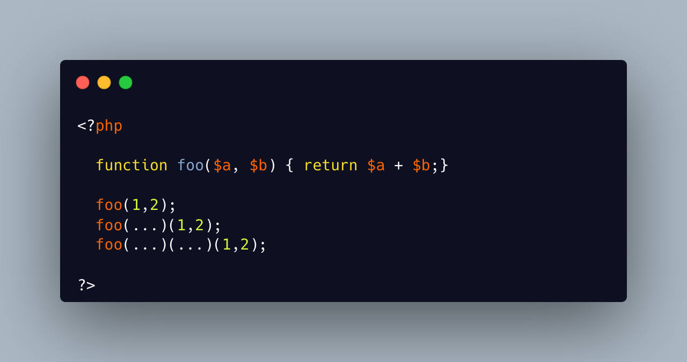

.. _closure-to-call:

Closure To Call
---------------

.. meta::
	:description:
		Closure To Call: The ``.
	:twitter:card: summary_large_image
	:twitter:site: @exakat
	:twitter:title: Closure To Call
	:twitter:description: Closure To Call: The ``
	:twitter:creator: @exakat
	:twitter:image:src: https://php-tips.readthedocs.io/en/latest/_images/closure_to_call.png.png
	:og:image: https://php-tips.readthedocs.io/en/latest/_images/closure_to_call.png
	:og:title: Closure To Call
	:og:type: article
	:og:description: The ``
	:og:url: https://php-tips.readthedocs.io/en/latest/tips/closure_to_call.html
	:og:locale: en

The ``...`` operator can be used to create a closure from a method. That closure can be called immediately, or used to create yet another closure. That processed is not guarded, so the ``(...)`` operator can be called multiple times, without any effect.

* `First Class Callable Syntax (PHP manual) <https://www.php.net/manual/en/functions.first_class_callable_syntax.php>`_

