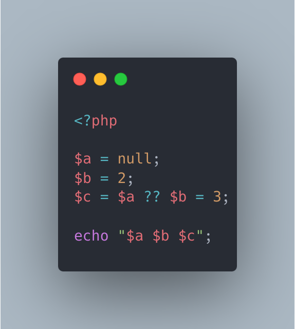

.. _coalesce-and-assignation:

Coalesce And Assignation
------------------------

.. meta::
	:description:
		Coalesce And Assignation: The coalesce operator has lower precedence than assignment, meaning the assignment occurs first.
	:twitter:card: summary_large_image
	:twitter:site: @exakat
	:twitter:title: Coalesce And Assignation
	:twitter:description: Coalesce And Assignation: The coalesce operator has lower precedence than assignment, meaning the assignment occurs first
	:twitter:creator: @exakat
	:twitter:image:src: https://php-tips.readthedocs.io/en/latest/_images/coalesce_and_assignation.png
	:og:image: https://php-tips.readthedocs.io/en/latest/_images/coalesce_and_assignation.png
	:og:title: Coalesce And Assignation
	:og:type: article
	:og:description: The coalesce operator has lower precedence than assignment, meaning the assignment occurs first
	:og:url: https://php-tips.readthedocs.io/en/latest/tips/coalesce_and_assignation.html
	:og:locale: en

.. raw:: html

	

The coalesce operator has lower precedence than assignment, meaning the assignment occurs first. Essentially, it behaves like parentheses: the right-hand expression is evaluated and stored in the variable, and then that stored value is used in the coalesce operation. This order of execution ensures the variable holds the evaluated result before it's processed by the coalesce logic.

See Also
________

* `Operators precedence <https://www.php.net/manual/en/language.operators.precedence.php>`_
* `Null Coalesce Operator <https://www.php.net/manual/en/language.operators.comparison.php#language.operators.comparison.coalesce>`_
* `Coalesce and assignation <https://3v4l.org/X84C1>`_ [Try me]

PHP Features
____________

* `precedence <https://php-dictionary.readthedocs.io/en/latest/dictionary/precedence.ini.html>`_

* `operator <https://php-dictionary.readthedocs.io/en/latest/dictionary/operator.ini.html>`_

* `coalesce <https://php-dictionary.readthedocs.io/en/latest/dictionary/coalesce.ini.html>`_

* `assignation <https://php-dictionary.readthedocs.io/en/latest/dictionary/assignation.ini.html>`_

