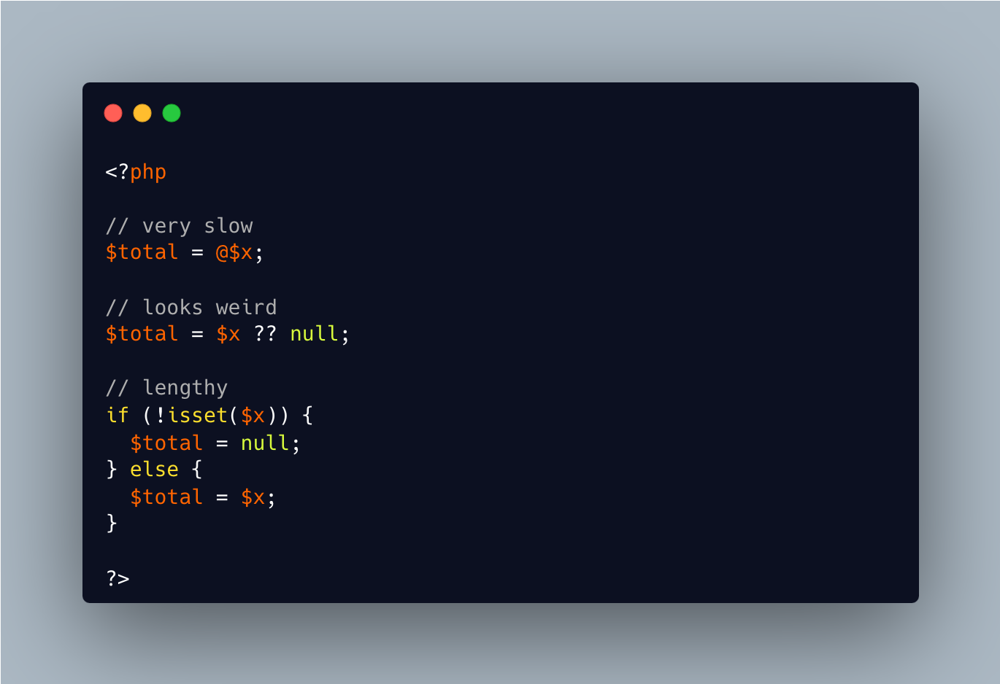

.. _coalesce-and-null:

Coalesce And Null
-----------------

	.. meta::
		:description lang=en:
			Coalesce And Null: I'm still struggling to pick a PHP side.

I'm still struggling to pick a PHP side.

@ is too slow, because it merely hides the error.

?? looks dumb: it reads : if it is null, use null as default.

the if() command is long to type.

* `Error Control Operators <https://www.php.net/manual/en/language.operators.errorcontrol.php>`_

