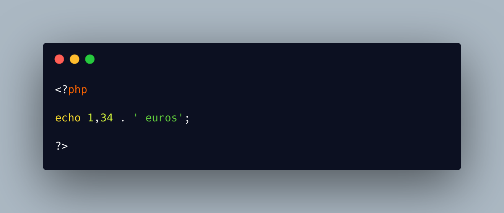

.. _where-did-the-comma-go?:

Where Did The Comma Go?
-----------------------

.. meta::
	:description:
		Where Did The Comma Go?: It took me way too long to figure out this one.
	:twitter:card: summary_large_image
	:twitter:site: @exakat
	:twitter:title: Where Did The Comma Go?
	:twitter:description: Where Did The Comma Go?: It took me way too long to figure out this one
	:twitter:creator: @exakat
	:twitter:image:src: https://php-tips.readthedocs.io/en/latest/_images/comma_in_number.png
	:og:image: https://php-tips.readthedocs.io/en/latest/_images/comma_in_number.png
	:og:title: Where Did The Comma Go?
	:og:type: article
	:og:description: It took me way too long to figure out this one
	:og:url: https://php-tips.readthedocs.io/en/latest/tips/comma_in_number.html
	:og:locale: en

.. raw:: html

	

It took me way too long to figure out this one. In certain cultures, the comma ``,`` is the decimal separator. And here, it looks all good, in particular since there is a dot ``.`` afterwards.

``echo`` does not need the parenthesis, as it is a language construct. In fact, the parenthesis would have prevented the error here, since there cannot be commas inside them.

See Also
________

* `1,34 <https://3v4l.org/6QLph>`_ [Try me]

PHP Features
____________

* `echo <https://php-dictionary.readthedocs.io/en/latest/dictionary/echo.ini.html>`_

* `numeric-separator <https://php-dictionary.readthedocs.io/en/latest/dictionary/numeric-separator.ini.html>`_

* `language-construct <https://php-dictionary.readthedocs.io/en/latest/dictionary/language-construct.ini.html>`_

* `parenthesis <https://php-dictionary.readthedocs.io/en/latest/dictionary/parenthesis.ini.html>`_

