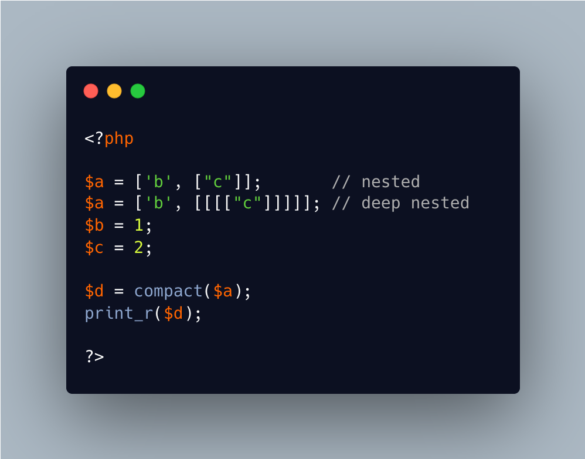

.. _compact()-is-recursive:

compact() Is Recursive
----------------------

.. meta::
	:description:
		compact() Is Recursive: ``compact()`` accepts an array of strings.
	:twitter:card: summary_large_image
	:twitter:site: @exakat
	:twitter:title: compact() Is Recursive
	:twitter:description: compact() Is Recursive: ``compact()`` accepts an array of strings
	:twitter:creator: @exakat
	:twitter:image:src: https://php-tips.readthedocs.io/en/latest/_images/compact_is_recursive.png
	:og:image: https://php-tips.readthedocs.io/en/latest/_images/compact_is_recursive.png
	:og:title: compact() Is Recursive
	:og:type: article
	:og:description: ``compact()`` accepts an array of strings
	:og:url: https://php-tips.readthedocs.io/en/latest/tips/compact_is_recursive.html
	:og:locale: en

.. raw:: html

	

``compact()`` accepts an array of strings... and arrays. It uses the available arguments recursively, yet produces an array with only one level: the deep nesting is lots at compacting type.

In fact, if the variables are indeed available at compact() time, compact flattens the array, and turns it into a simple list.

It also means that it is prone to recursive error.

See Also
________

* `compact() (PHP manual) <https://www.php.net/compact>`_
* `extract() (PHP manual) <https://www.php.net/extract>`_
* `Recursive compact() <https://3v4l.org/EEAKb>`_

PHP Error Messages
__________________

* `Recursion detected <https://php-errors.readthedocs.io/en/latest/messages/recursion-detected.html>`_

