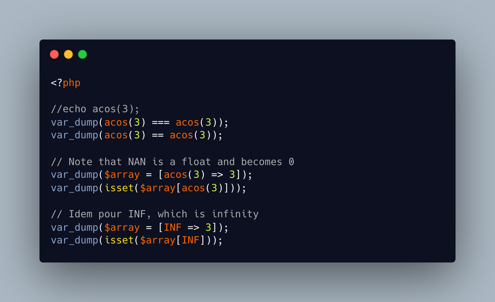

.. _comparing-nan:

Comparing NAN
-------------

.. meta::
	:description:
		Comparing NAN: PHP does not compare ``NAN`` values: it always fails, even if the source is the same.
	:twitter:card: summary_large_image
	:twitter:site: @exakat
	:twitter:title: Comparing NAN
	:twitter:description: Comparing NAN: PHP does not compare ``NAN`` values: it always fails, even if the source is the same
	:twitter:creator: @exakat
	:twitter:image:src: https://php-tips.readthedocs.io/en/latest/_images/compare_nan.png
	:og:image: https://php-tips.readthedocs.io/en/latest/_images/compare_nan.png
	:og:title: Comparing NAN
	:og:type: article
	:og:description: PHP does not compare ``NAN`` values: it always fails, even if the source is the same
	:og:url: https://php-tips.readthedocs.io/en/latest/tips/compare_nan.html
	:og:locale: en

.. raw:: html

	

PHP does not compare ``NAN`` values: it always fails, even if the source is the same.

Depending on the context, ``NAN`` becomes the string ``'NAN'``, or the integer ``0``.

Since PHP 8.1, the engine emits a warning to signal it: this is good, and helps spotting such mistakes.

And, in the end, no one uses ``NAN`` anyway.

See Also
________

* `Is Not A NAN <https://php-tips.readthedocs.io/en/latest/tips/is_not_a_nan.html>`_
* `nan !== nan <https://3v4l.org/N6AoL>`_ [Try me]

PHP Features
____________

* `nan <https://php-dictionary.readthedocs.io/en/latest/dictionary/nan.ini.html>`_

* `inf <https://php-dictionary.readthedocs.io/en/latest/dictionary/inf.ini.html>`_

* `comparison <https://php-dictionary.readthedocs.io/en/latest/dictionary/comparison.ini.html>`_

