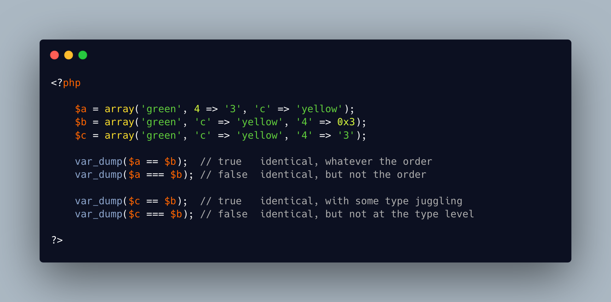

.. _comparing-arrays-and-object:

Comparing Arrays And Object
---------------------------

.. meta::
	:description:
		Comparing Arrays And Object: ``==`` and ``===`` apply different algorithms to compare arrays.
	:twitter:card: summary_large_image
	:twitter:site: @exakat
	:twitter:title: Comparing Arrays And Object
	:twitter:description: Comparing Arrays And Object: ``==`` and ``===`` apply different algorithms to compare arrays
	:twitter:creator: @exakat
	:twitter:image:src: https://php-tips.readthedocs.io/en/latest/_images/comparing-arrays.png
	:og:image: https://php-tips.readthedocs.io/en/latest/_images/comparing-arrays.png
	:og:title: Comparing Arrays And Object
	:og:type: article
	:og:description: ``==`` and ``===`` apply different algorithms to compare arrays
	:og:url: https://php-tips.readthedocs.io/en/latest/tips/comparing-arrays.html
	:og:locale: en

.. raw:: html

	

``==`` and ``===`` apply different algorithms to compare arrays.

``==`` compares keys without taking order in account, while ``===`` also takes into account the order.

``==`` applies type juggling to values, and then compare them loosely, while ``===`` makes a identity comparison, with value and type. ``==`` and ``===`` compare keys the same way, as they can only be ``int`` or ``string``, and no type-juggling is applied.

The same rules apply when comparing objects: the order of assignations of the properties is used by ``==`` but not by ``===``.

Finally, comparing an array and an object always fails: one of them has to be cast.

See Also
________

* `Comparing arrays <https://3v4l.org/Zqkng>`_ [Try me]
* `Comparing object <https://3v4l.org/isKLn>`_ [Try me]

PHP Features
____________

* `comparison <https://php-dictionary.readthedocs.io/en/latest/dictionary/comparison.ini.html>`_

* `array <https://php-dictionary.readthedocs.io/en/latest/dictionary/array.ini.html>`_

* `property <https://php-dictionary.readthedocs.io/en/latest/dictionary/property.ini.html>`_

* `cast <https://php-dictionary.readthedocs.io/en/latest/dictionary/cast.ini.html>`_

