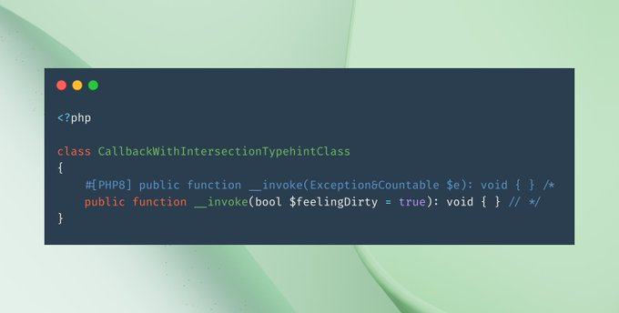

.. _compatible-signature:

Compatible Signature
--------------------

.. meta::
	:description:
		Compatible Signature: This piece of code shows a signature that changes with the version of PHP.
	:twitter:card: summary_large_image
	:twitter:site: @exakat
	:twitter:title: Compatible Signature
	:twitter:description: Compatible Signature: This piece of code shows a signature that changes with the version of PHP
	:twitter:creator: @exakat
	:twitter:image:src: https://php-tips.readthedocs.io/en/latest/_images/compatible-signature.png
	:og:image: https://php-tips.readthedocs.io/en/latest/_images/compatible-signature.png
	:og:title: Compatible Signature
	:og:type: article
	:og:description: This piece of code shows a signature that changes with the version of PHP
	:og:url: https://php-tips.readthedocs.io/en/latest/tips/compatible-signature.html
	:og:locale: en

.. raw:: html

	

By `Christian Lück <https://x.com/another_clue>`_

This piece of code shows a signature that changes with the version of PHP.

Indeed, in PHP 7.x, the comment starts with ``#`` and goes to the end of the line. This also covers the ``/*`` so the multi ligne comment doesn't start, and the ``__invoke`` signature is the second one.

In PHP 8.0, the attributes ``#[PHP8]`` ends with its closing square bracket, and the signature of ``__invoke`` starts. By the end of the line, a multi-line comments starts, and covers the whole second line.

In the end, this code stays unchanged between PHP versions, although it toggles different signatures.

See Also
________

* `Attributes (PHP manual) <https://www.php.net/manual/en/language.attributes.overview.php>`_
* `Original tweet <https://x.com/another_clue/status/1671189006162464768>`_
* `Aboard the compatibility train <https://3v4l.org/KrZlK>`_ [Try me]

