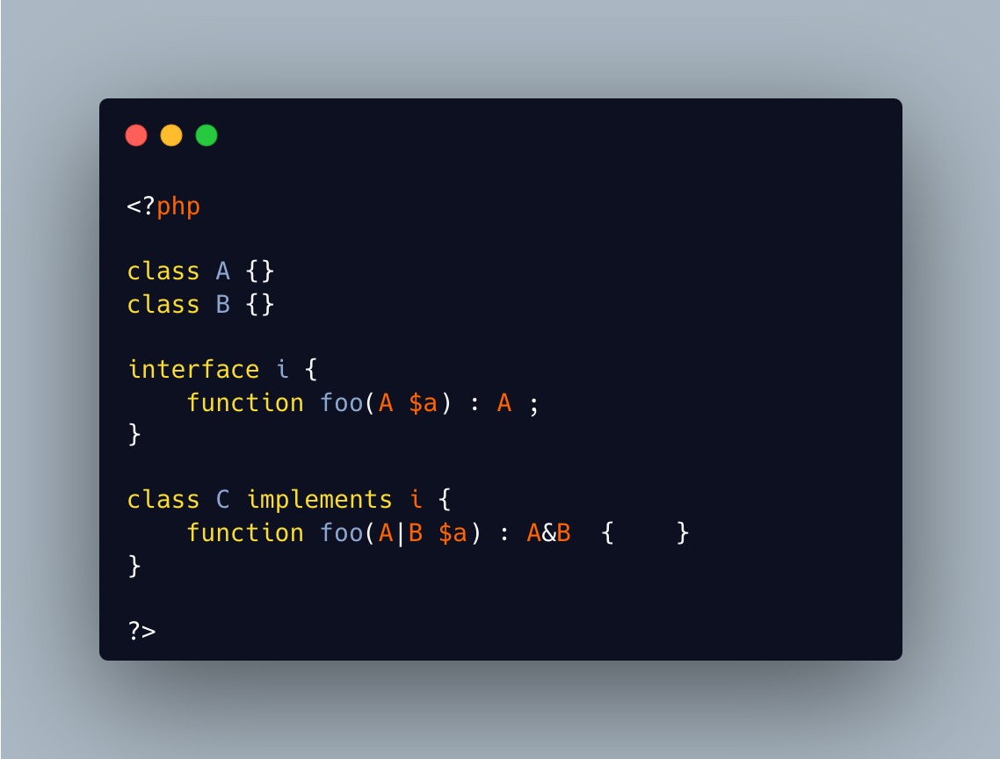

.. _compatible-only-interface:

Compatible Only Interface
-------------------------

.. meta::
	:description:
		Compatible Only Interface: Interfaces are contracts that defines methods signatures, which implmenting class have to implements.
	:twitter:card: summary_large_image
	:twitter:site: @exakat
	:twitter:title: Compatible Only Interface
	:twitter:description: Compatible Only Interface: Interfaces are contracts that defines methods signatures, which implmenting class have to implements
	:twitter:creator: @exakat
	:twitter:image:src: https://php-tips.readthedocs.io/en/latest/_images/compatible_interface.png
	:og:image: https://php-tips.readthedocs.io/en/latest/_images/compatible_interface.png
	:og:title: Compatible Only Interface
	:og:type: article
	:og:description: Interfaces are contracts that defines methods signatures, which implmenting class have to implements
	:og:url: https://php-tips.readthedocs.io/en/latest/tips/compatible_interface.html
	:og:locale: en

.. raw:: html

	

Interfaces are contracts that defines methods signatures, which implmenting class have to implements.

One lesser known fact is that the implementation only has to be compatible with the interface, there is no need to be identical. It is the same behavior than in class inheritence.

This explains that the following code is valid, both with argument contra-variance and return type variance.

Note that the names of the parameters are completely free to be changed at will, yet it is not recommended.

See Also
________

* `Object Interfaces (PHP manual) <https://www.php.net/manual/en/language.oop5.interfaces.php>`_
* `Example code on 3v4l.org (VhsoJ) <https://3v4l.org/VhsoJ>`_
* `Extended interface <https://3v4l.org/u9kQ3>`_

