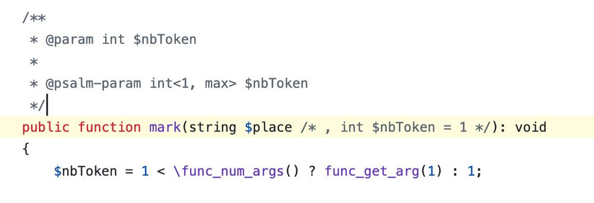

.. _keep-interface-new-argument-compatible:

Keep Interface New Argument Compatible
--------------------------------------

.. meta::
	:description:
		Keep Interface New Argument Compatible: A reminder for maintainers of PHP libraries: adding a parameter to a method of an interface causes a fatal error in all the classes that implement it.
	:twitter:card: summary_large_image
	:twitter:site: @exakat
	:twitter:title: Keep Interface New Argument Compatible
	:twitter:description: Keep Interface New Argument Compatible: A reminder for maintainers of PHP libraries: adding a parameter to a method of an interface causes a fatal error in all the classes that implement it
	:twitter:creator: @exakat
	:twitter:image:src: https://php-tips.readthedocs.io/en/latest/_images/compatible_new_argument.png
	:og:image: https://php-tips.readthedocs.io/en/latest/_images/compatible_new_argument.png
	:og:title: Keep Interface New Argument Compatible
	:og:type: article
	:og:description: A reminder for maintainers of PHP libraries: adding a parameter to a method of an interface causes a fatal error in all the classes that implement it
	:og:url: https://php-tips.readthedocs.io/en/latest/tips/compatible_new_argument.html
	:og:locale: en

.. raw:: html

	

By `Jerome Tamarelle <https://bsky.app/profile/jerome.tamarelle.net>`_

A reminder for maintainers of PHP libraries: adding a parameter to a method of an interface causes a fatal error in all the classes that implement it. It's a BC break that should be prohibed in a minor version.

In Symfony, we add the parameter virtually using phpdoc, and read it using func_get_arg().

See Also
________

* `Original BluSky <https://bsky.app/profile/jerome.tamarelle.net/post/3lmweebhmxs2y>`_
* `func_get_arg <https://www.php.net/manual/en/function.func-get-arg.php>`_
* `Example code <https://3v4l.org/g3htG>`_ [Try me]

PHP Features
____________

* `compatibility <https://php-dictionary.readthedocs.io/en/latest/dictionary/compatibility.ini.html>`_

