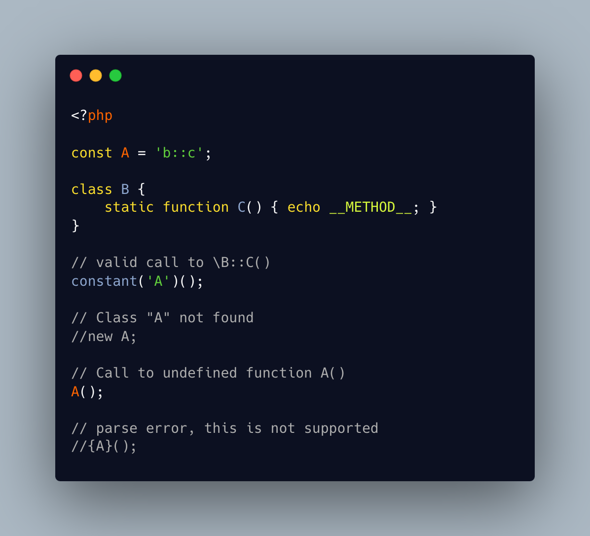

.. _identifier-confusions:

Identifier Confusions
---------------------

.. meta::
	:description:
		Identifier Confusions: Identifiers are used both for constant names and for class names (CITE).
	:twitter:card: summary_large_image
	:twitter:site: @exakat
	:twitter:title: Identifier Confusions
	:twitter:description: Identifier Confusions: Identifiers are used both for constant names and for class names (CITE)
	:twitter:creator: @exakat
	:twitter:image:src: https://php-tips.readthedocs.io/en/latest/_images/confusing_identifier.png
	:og:image: https://php-tips.readthedocs.io/en/latest/_images/confusing_identifier.png
	:og:title: Identifier Confusions
	:og:type: article
	:og:description: Identifiers are used both for constant names and for class names (CITE)
	:og:url: https://php-tips.readthedocs.io/en/latest/tips/confusing_identifier.html
	:og:locale: en

.. raw:: html

	

Identifiers are used both for constant names and for class names (CITE). Depending on the situation, they may be confused one for the other: here, ``A`` is a constant, and its value is accessible for dynamic code purposes. Yet, ``A()`` cannot be used.

There is no syntax to call dynamically a function whose name is stored in a constant, without resorting to a call the the ``constant()`` function or a temporary variable.

See Also
________

* `What is in an identifier <https://3v4l.org/c16hv>`_ [Try me]

PHP Features
____________

* `constant <https://php-dictionary.readthedocs.io/en/latest/dictionary/constant.ini.html>`_

* `identifier <https://php-dictionary.readthedocs.io/en/latest/dictionary/identifier.ini.html>`_

* `class <https://php-dictionary.readthedocs.io/en/latest/dictionary/class.ini.html>`_

