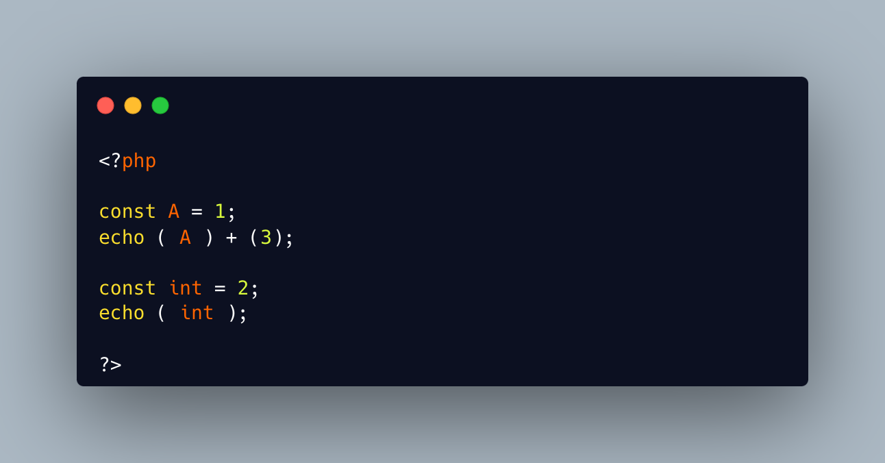

.. _const-without-parenthesis:

Const Without Parenthesis
-------------------------

.. meta::
	:description:
		Const Without Parenthesis: It is possible to put a single literal inside parenthesis: that's just the literal itself.
	:twitter:card: summary_large_image
	:twitter:site: @exakat
	:twitter:title: Const Without Parenthesis
	:twitter:description: Const Without Parenthesis: It is possible to put a single literal inside parenthesis: that's just the literal itself
	:twitter:creator: @exakat
	:twitter:image:src: https://php-tips.readthedocs.io/en/latest/_images/const_without_parenthesis.png
	:og:image: https://php-tips.readthedocs.io/en/latest/_images/const_without_parenthesis.png
	:og:title: Const Without Parenthesis
	:og:type: article
	:og:description: It is possible to put a single literal inside parenthesis: that's just the literal itself
	:og:url: https://php-tips.readthedocs.io/en/latest/tips/const_without_parenthesis.html
	:og:locale: en

.. raw:: html

	

It is possible to put a single literal inside parenthesis: that's just the literal itself.

It is possible to put a single global constant inside parenthesis: that's just the global constant itself.

It is possible to create a constant called ``int``, because the name is not protected against usage, even if it is reserved for type and casting.

Then, it is not possible to ``int`` in parenthesis, because PHP confuses it with a cast.

See Also
________

* `Type Operators (PHP manual) <https://www.php.net/manual/en/language.operators.type.php>`_
* `(int) compilation error <https://3v4l.org/1Lt2o>`_

