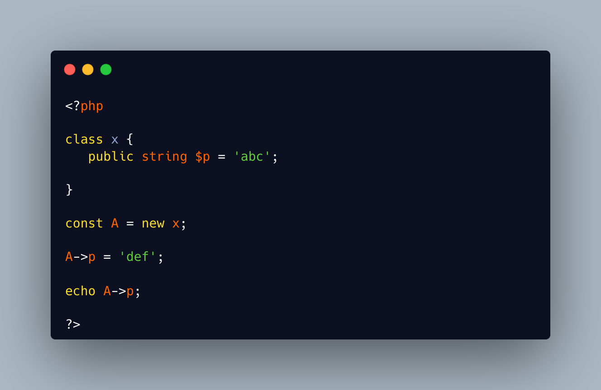

.. _constants-are-mutable:

Constants Are Mutable
---------------------

	.. meta::
		:description lang=en:
			Constants Are Mutable: Since PHP 8.

Since PHP 8.2, it is possible to use an object with a constant: this is the new initializer feature.

With a object in a constant, it is still possible to call methods or properties, and mutate the constants. Indeed, the constant is still representing the same object, but the properties in the objects are not constants.

* `Class Constants <https://www.php.net/manual/en/language.oop5.constants.php#language.oop5.constants>`_
* `Constants are no longer constant in PHP <https://dev.to/hbgl/constants-are-no-longer-constant-in-php-oco>`_

