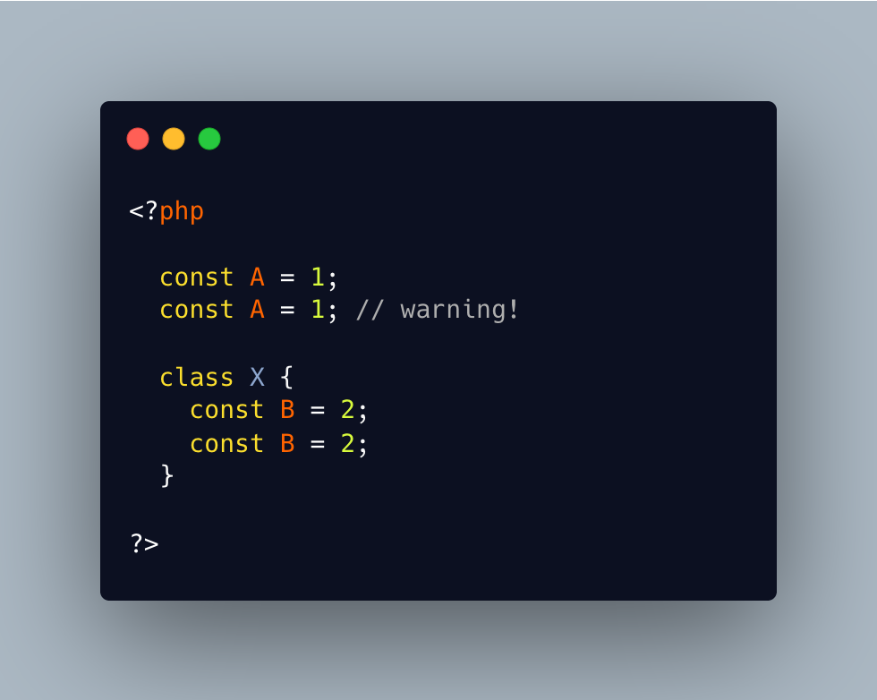

.. _constant-redefinition:

Constant Redefinition
---------------------

.. meta::
	:description:
		Constant Redefinition: It is possible to specify several identical global constant definition: PHP reports a warning, and ignores the second definitions.
	:twitter:card: summary_large_image
	:twitter:site: @exakat
	:twitter:title: Constant Redefinition
	:twitter:description: Constant Redefinition: It is possible to specify several identical global constant definition: PHP reports a warning, and ignores the second definitions
	:twitter:creator: @exakat
	:twitter:image:src: https://php-tips.readthedocs.io/en/latest/_images/constant_redefinition.png
	:og:image: https://php-tips.readthedocs.io/en/latest/_images/constant_redefinition.png
	:og:title: Constant Redefinition
	:og:type: article
	:og:description: It is possible to specify several identical global constant definition: PHP reports a warning, and ignores the second definitions
	:og:url: https://php-tips.readthedocs.io/en/latest/tips/constant_redefinition.html
	:og:locale: en

.. raw:: html

	

It is possible to specify several identical global constant definition: PHP reports a warning, and ignores the second definitions.

On the other hand, a duplicate class constant definition is a fatal error, and fails the compilation phase.

The difference of behavior may be linked to the level of consistence that PHP can achieve: global constants needs an application wide check for name unicity, while class constants can be checked while compiling a class.

Yet, it might be worth looking into leveling both errors, to avoid hard to find bugs.

See Also
________

* `Constants (PHP manual) <https://www.php.net/manual/en/language.constants.php>`_
* `Redefinition of a constant <https://3v4l.org/mHLNu>`_

