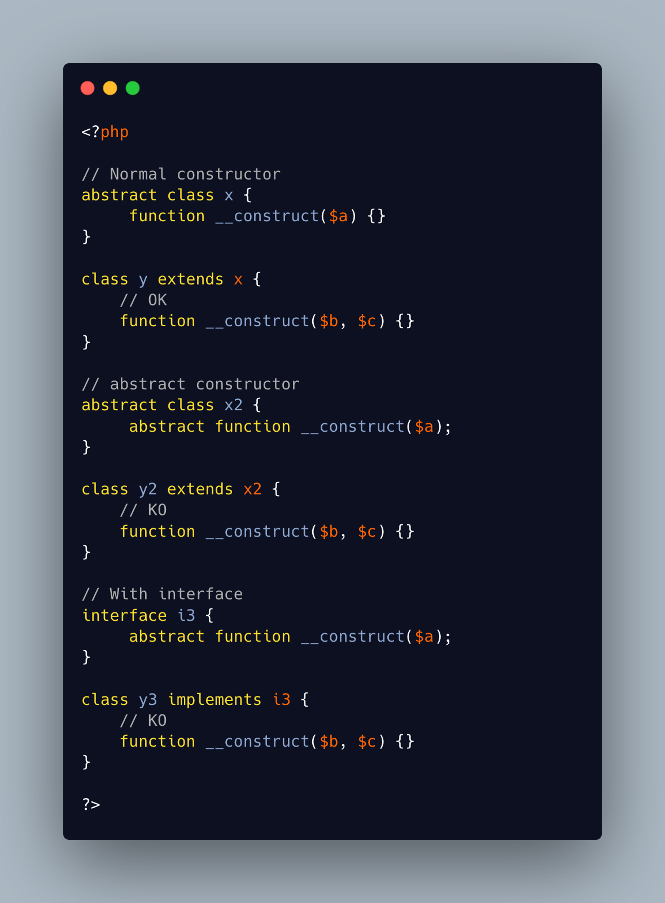

.. _signature-compatibility-exception:

Signature Compatibility Exception
---------------------------------

All methods must be compatible with their parent's signature: the types, reference options, variadic and number must be compatible (although, not equal).

The only exception are constructors, which may be completely different from their parent's. This is for backward compatibility.

* `constructors <https://www.php.net/manual/en/control-structures.declare.php>`_

