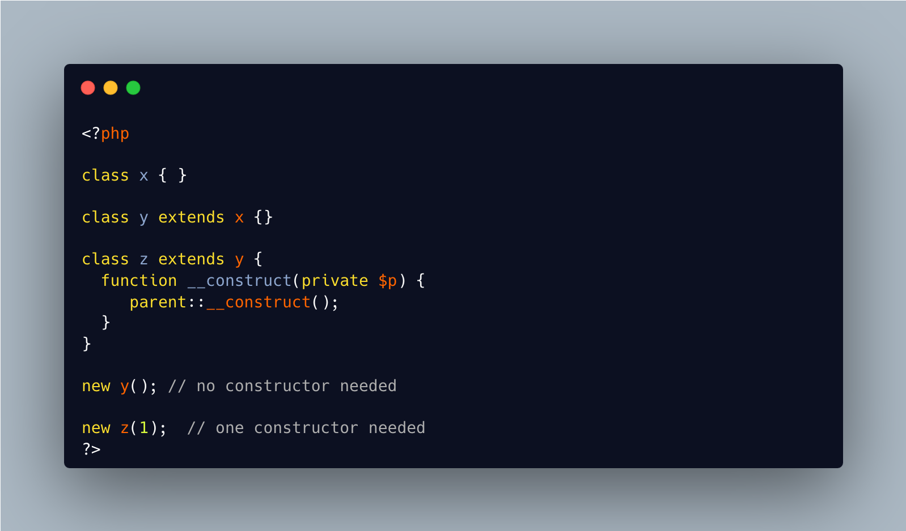

.. _constructor-needed:

Constructor Needed
------------------

.. meta::
	:description:
		Constructor Needed: By default, classes don't need a constructor, and it may be omitted.
	:twitter:card: summary_large_image
	:twitter:site: @exakat
	:twitter:title: Constructor Needed
	:twitter:description: Constructor Needed: By default, classes don't need a constructor, and it may be omitted
	:twitter:creator: @exakat
	:twitter:image:src: https://php-tips.readthedocs.io/en/latest/_images/constructor_needed.png
	:og:image: https://php-tips.readthedocs.io/en/latest/_images/constructor_needed.png
	:og:title: Constructor Needed
	:og:type: article
	:og:description: By default, classes don't need a constructor, and it may be omitted
	:og:url: https://php-tips.readthedocs.io/en/latest/tips/constructor_needed.html
	:og:locale: en

.. raw:: html

	

By default, classes don't need a constructor, and it may be omitted. It is also true in the case of child classes: PHP look for a local constructor, then a parent constructor, and it is valid to have none of them.

On the other hand, if any of the child makes an explicit call to ``parent::__construct``, then, there must be at least an explicit constructor in the family. Or, PHP generates ``Cannot call constructor`` error message. 

As a rule of thumb, it might be good to always include the constructor definition, to avoid adding it later, down the road.

See Also
________

* `Constructors and Destructors (PHP manual) <https://www.php.net/manual/en/language.oop5.decon.php>`_
* `What is in an identifier <https://3v4l.org/c16hv>`_

PHP Error Messages
__________________

* `Cannot call constructor <https://php-errors.readthedocs.io/en/latest/messages/cannot-call-constructor.html>`_

