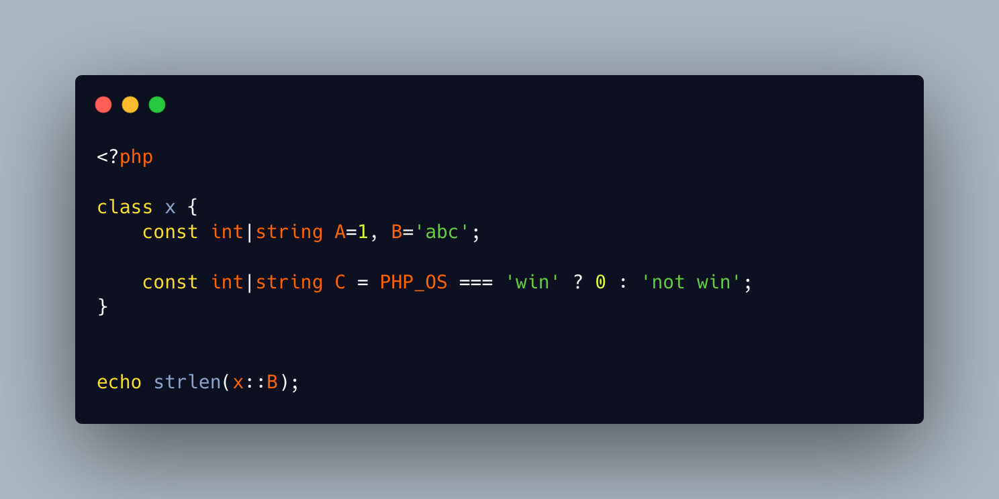

.. _multiple-const-types:

Multiple Const Types
--------------------

.. meta::
	:description:
		Multiple Const Types: Class constants may be typed since PHP 8.
	:twitter:card: summary_large_image
	:twitter:site: @exakat
	:twitter:title: Multiple Const Types
	:twitter:description: Multiple Const Types: Class constants may be typed since PHP 8
	:twitter:creator: @exakat
	:twitter:image:src: https://php-tips.readthedocs.io/en/latest/_images/crazy_const_type.png
	:og:image: https://php-tips.readthedocs.io/en/latest/_images/crazy_const_type.png
	:og:title: Multiple Const Types
	:og:type: article
	:og:description: Class constants may be typed since PHP 8
	:og:url: https://php-tips.readthedocs.io/en/latest/tips/crazy_const_type.html
	:og:locale: en

.. raw:: html

	

Class constants may be typed since PHP 8.3. Union types are possible, and they are valid with class constants.

In the first case, two constants are declared with different types. PHP complains if any of the types does not apply to the values, so the union type is needed to ensure that both constant are well declared. Obviously, they should be declared on distinct ``const`` expressions.

In the second case, the constant is defined with a condition. Now, ``rand()`` cannot be called in that part of the code, but using other constants, native such as ``PHP_OS``, ``__FILE__``, custom, global or ``define()``d may impact the expression, and lead to different results and types. This is a theoretical case, and it has never been seen in the wild.

See Also
________

* `Multiple Const Types <https://3v4l.org/ElUNU>`_ [Try me]

PHP Error Messages
__________________

* `Cannot use int as value for class constant x::A of type string <https://php-errors.readthedocs.io/en/latest/messages/cannot-use-%25s-as-value-for-class-constant-%25s%3A%3A%25s-of-type-%25s.html>`_

PHP Features
____________

* `constant <https://php-dictionary.readthedocs.io/en/latest/dictionary/constant.ini.html>`_

* `class-constant <https://php-dictionary.readthedocs.io/en/latest/dictionary/class-constant.ini.html>`_

* `typed-constant <https://php-dictionary.readthedocs.io/en/latest/dictionary/typed-constant.ini.html>`_

* `union-type <https://php-dictionary.readthedocs.io/en/latest/dictionary/union-type.ini.html>`_

* `condition <https://php-dictionary.readthedocs.io/en/latest/dictionary/condition.ini.html>`_

