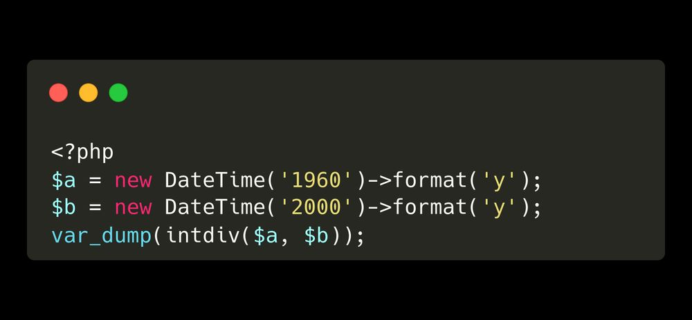

.. _datetime-object,-and-years:

Datetime Object, And Years
--------------------------

.. meta::
	:description:
		Datetime Object, And Years: In this code, 2 years are given to datetime, and handed back.
	:twitter:card: summary_large_image
	:twitter:site: @exakat
	:twitter:title: Datetime Object, And Years
	:twitter:description: Datetime Object, And Years: In this code, 2 years are given to datetime, and handed back
	:twitter:creator: @exakat
	:twitter:image:src: https://php-tips.readthedocs.io/en/latest/_images/datetime_and_year.png
	:og:image: https://php-tips.readthedocs.io/en/latest/_images/datetime_and_year.png
	:og:title: Datetime Object, And Years
	:og:type: article
	:og:description: In this code, 2 years are given to datetime, and handed back
	:og:url: https://php-tips.readthedocs.io/en/latest/tips/datetime_and_year.html
	:og:locale: en

.. raw:: html

	

By `Frederic Bouchery <https://bsky.app/profile/bouchery.fr>`_

In this code, 2 years are given to datetime, and handed back. Yet, they return the same value: 2024.

Under the hood, PHP attempts to decode the number. Instead of recognizing a year, it recongnizes an hour. And, by default, it set the rest of the date to today. Later, when the date is formatted, the year becomes 2024.

One piece of advice is to format the date to PHP's liking, or use the ``createFromFormat()`` method, which uses a provided format to decode the string.

See Also
________

* `Datetime (PHP manual) <https://www.php.net/manual/en/class.datetime.php>`_
* `How is this code running <https://3v4l.org/6CCFl>`_ [Try me]

