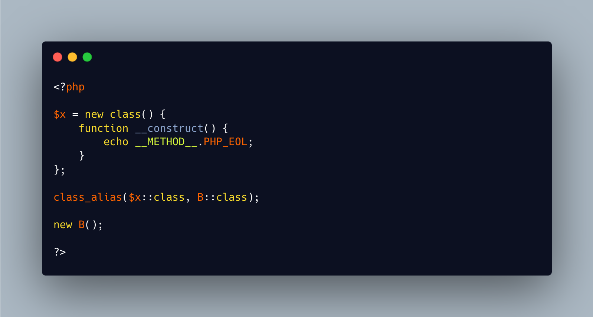

.. _deanonymize-class:

Deanonymize Class
-----------------

.. meta::
	:description:
		Deanonymize Class: Anonymize class are classes without a name.
	:twitter:card: summary_large_image
	:twitter:site: @exakat
	:twitter:title: Deanonymize Class
	:twitter:description: Deanonymize Class: Anonymize class are classes without a name
	:twitter:creator: @exakat
	:twitter:image:src: https://php-tips.readthedocs.io/en/latest/_images/deanonymize-class.png
	:og:image: https://php-tips.readthedocs.io/en/latest/_images/deanonymize-class.png
	:og:title: Deanonymize Class
	:og:type: article
	:og:description: Anonymize class are classes without a name
	:og:url: https://php-tips.readthedocs.io/en/latest/tips/deanonymize-class.html
	:og:locale: en

.. raw:: html

	

Anonymize class are classes without a name. That way, it provides directly an object, but doesn't litter the namespace with an extra class name. 

Later, if the code needs a second object of the same 'class', it has to go through the same code. 

Or, it is possible to get access to the 'hidden' definition of the class within PHP, by simply creating a class alias to this class. Then, it can be used anywhere else.

The sane alternative might be to simply give a name to the class, or make a direct clone of the object.

And as usual, if that class is not under the code's own control (say, external lib), it might be useful though hackish.

See Also
________

* `Anonymous Classes (PHP manual) <https://www.php.net/manual/en/language.oop5.anonymous.php>`_
* `Give a name to a class <https://3v4l.org/MLrBX>`_ [Try me]

