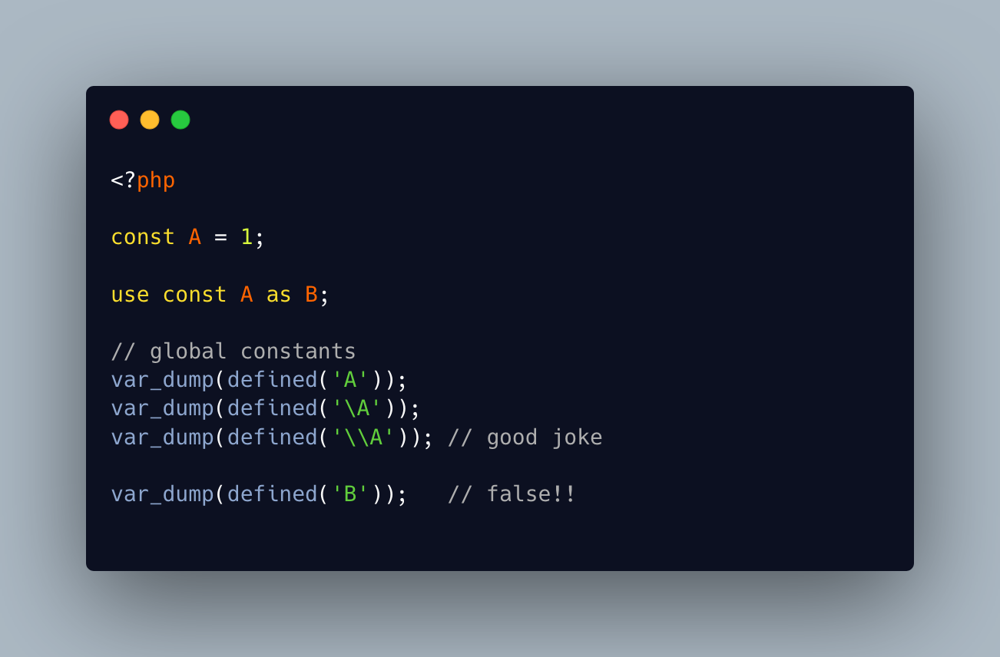

.. _defined()-in-action:

defined() In Action
-------------------

.. meta::
	:description:
		defined() In Action: The defined() function checks if a constant is defined or not.
	:twitter:card: summary_large_image
	:twitter:site: @exakat
	:twitter:title: defined() In Action
	:twitter:description: defined() In Action: The defined() function checks if a constant is defined or not
	:twitter:creator: @exakat
	:twitter:image:src: https://php-tips.readthedocs.io/en/latest/_images/defined.png
	:og:image: https://php-tips.readthedocs.io/en/latest/_images/defined.png
	:og:title: defined() In Action
	:og:type: article
	:og:description: The defined() function checks if a constant is defined or not
	:og:url: https://php-tips.readthedocs.io/en/latest/tips/defined.html
	:og:locale: en

.. raw:: html

	

The defined() function checks if a constant is defined or not.

It is possible to check the constant with its name, and with its namespace.

Beware of quotes: most often, when checking for the constant's value, the result is false.

On the other hand, it is not possible to check a constant with its aliased name: extra names, created with ``use`` are not validated.

To check for a class constant, it is possible to use a string, with the class name and the ``::`` separator. Then, the visibility of the class constant is taken into account: it might be defined, but not accessible from that part of the code.

See Also
________

* `defined() in action <https://3v4l.org/Z3Yv9>`_ [Try me]

PHP Features
____________

* `constant <https://php-dictionary.readthedocs.io/en/latest/dictionary/constant.ini.html>`_

* `class-constant <https://php-dictionary.readthedocs.io/en/latest/dictionary/class-constant.ini.html>`_

