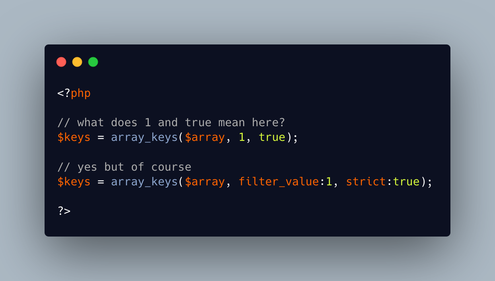

.. _documenting-parameters:

Documenting Parameters
----------------------

.. meta::
	:description:
		Documenting Parameters: Sometimes, even a literal value used as parameter is not readable.
	:twitter:card: summary_large_image
	:twitter:site: @exakat
	:twitter:title: Documenting Parameters
	:twitter:description: Documenting Parameters: Sometimes, even a literal value used as parameter is not readable
	:twitter:creator: @exakat
	:twitter:image:src: https://php-tips.readthedocs.io/en/latest/_images/documenting_parameter.png
	:og:image: https://php-tips.readthedocs.io/en/latest/_images/documenting_parameter.png
	:og:title: Documenting Parameters
	:og:type: article
	:og:description: Sometimes, even a literal value used as parameter is not readable
	:og:url: https://php-tips.readthedocs.io/en/latest/tips/documenting_parameter.html
	:og:locale: en

.. raw:: html

	

Sometimes, even a literal value used as parameter is not readable. An easy way to document the literal values is to provide the name of the paramter. Since the parameters need a smart name to be used in the method, using it in the method call provides more context to the parameter.

Another option is to make that literal value a constant, and use that constant to provide a readable name.

See Also
________

* `Named Arguments (PHP manual) <https://www.php.net/manual/en/functions.arguments.php#functions.named-arguments>`_
* `documenting parameters <https://3v4l.org/Qr4tP>`_ [Try me]

PHP Features
____________

* `named-parameter <https://php-dictionary.readthedocs.io/en/latest/dictionary/named-parameter.ini.html>`_

* `readability <https://php-dictionary.readthedocs.io/en/latest/dictionary/readability.ini.html>`_

