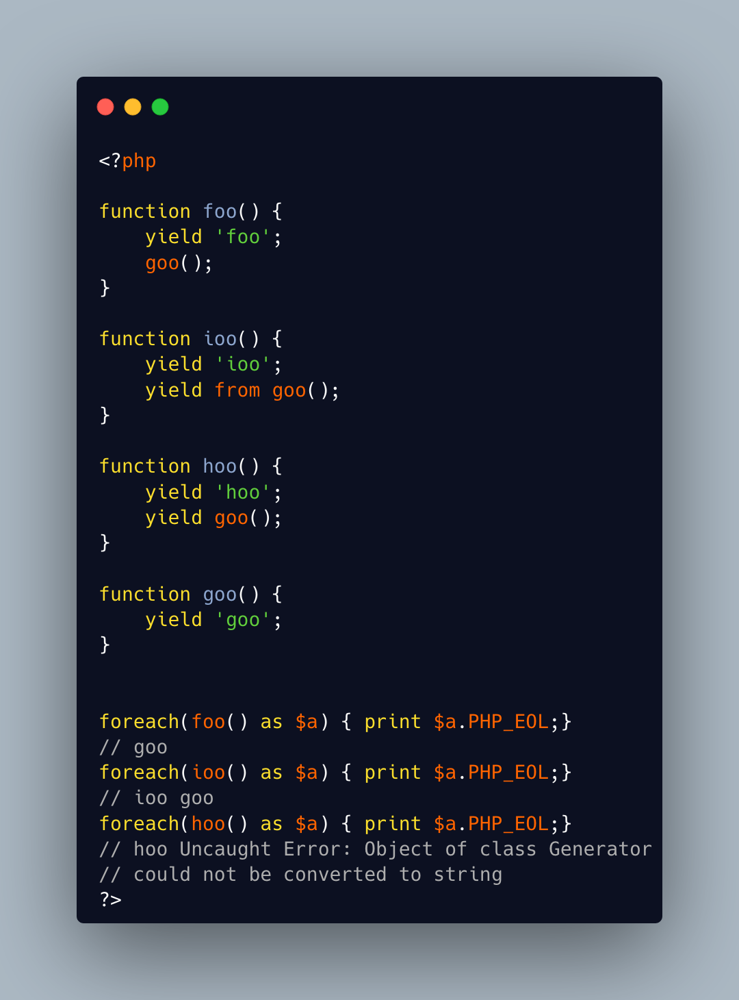

.. _don't-forget-to-yield:

Don't Forget To Yield
---------------------

.. meta::
	:description:
		Don't Forget To Yield: It is possible to delegate a generator to another generator.
	:twitter:card: summary_large_image.
	:twitter:site: @exakat.
	:twitter:title: Don't Forget To Yield.
	:twitter:description: Don't Forget To Yield: It is possible to delegate a generator to another generator.
	:twitter:creator: @exakat.
	:twitter:image:src: https://php-tips.readthedocs.io/en/latest/_images/dont_forget_yield.png.png.
	:og:image: https://php-tips.readthedocs.io/en/latest/_images/dont_forget_yield.png.png.
	:og:image: Don't Forget To Yield: It is possible to delegate a generator to another generator.

It is possible to delegate a generator to another generator.

Just don't call them raw, as nothing will happen.

And don't forget the 'from' part of the keyword, otherwise, it will yield the generator, instead of running it.

* `Generator syntax <https://www.php.net/manual/en/language.generators.syntax.php>`_

