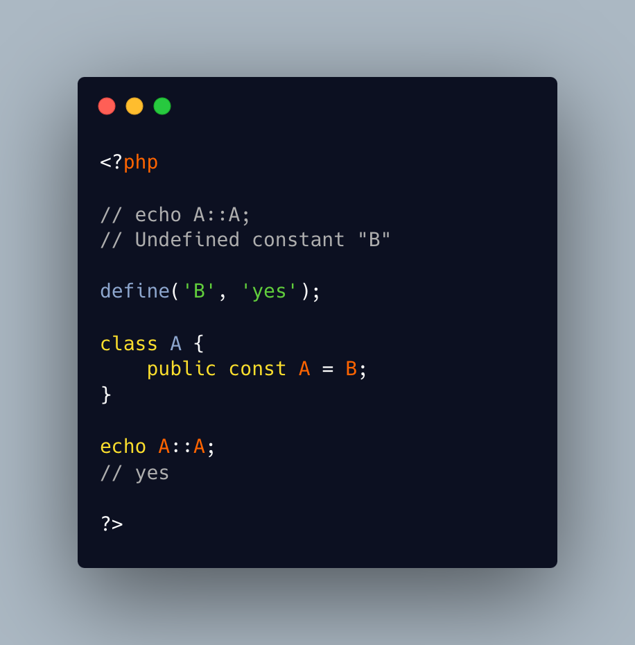

.. _dynamic-class-constant:

Dynamic Class Constant
----------------------

.. meta::
	:description:
		Dynamic Class Constant: It is not allowed to create dynamically a class constant.
	:twitter:card: summary_large_image
	:twitter:site: @exakat
	:twitter:title: Dynamic Class Constant
	:twitter:description: Dynamic Class Constant: It is not allowed to create dynamically a class constant
	:twitter:creator: @exakat
	:twitter:image:src: https://php-tips.readthedocs.io/en/latest/_images/dynamic_class_constant.png
	:og:image: https://php-tips.readthedocs.io/en/latest/_images/dynamic_class_constant.png
	:og:title: Dynamic Class Constant
	:og:type: article
	:og:description: It is not allowed to create dynamically a class constant
	:og:url: https://php-tips.readthedocs.io/en/latest/tips/dynamic_class_constant.html
	:og:locale: en

.. raw:: html

	

It is not allowed to create dynamically a class constant. The only way is to create a global constant, using the define() function.

So, when there is a need for a dynamically created constant, the trick is to assign the class constant a global constant's value, and then, create the global constant.

Of course, it is not possible to use that class constant until the global constant has been actually created.

See Also
________

* `Define() (PHP manual) <https://www.php.net/manual/en/function.define.php>`_
* `Define a dynamic class constant value <https://3v4l.org/MigJ2>`_ [Try me]

