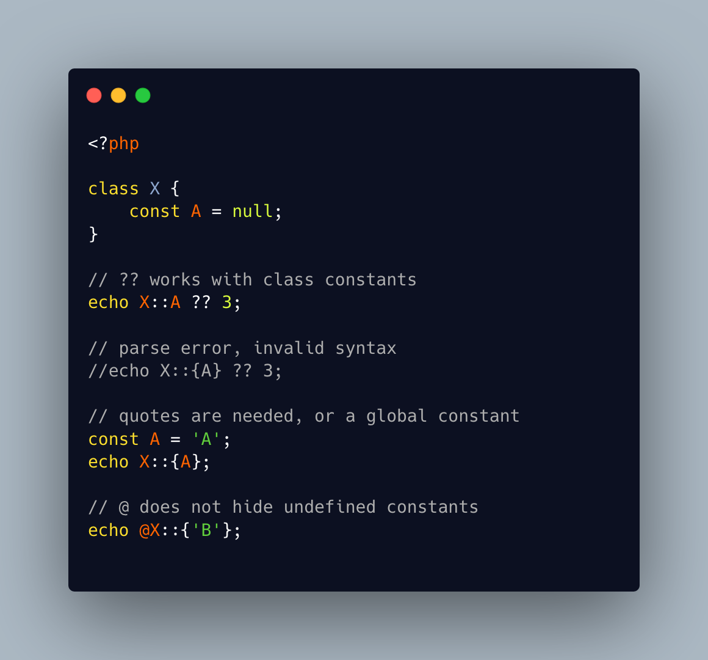

.. _dynamic-class-constant-edge-cases:

Dynamic Class Constant Edge Cases
---------------------------------

.. meta::
	:description:
		Dynamic Class Constant Edge Cases: PHP 8.
	:twitter:card: summary_large_image
	:twitter:site: @exakat
	:twitter:title: Dynamic Class Constant Edge Cases
	:twitter:description: Dynamic Class Constant Edge Cases: PHP 8
	:twitter:creator: @exakat
	:twitter:image:src: https://php-tips.readthedocs.io/en/latest/_images/dynamic_class_constant_edges.png
	:og:image: https://php-tips.readthedocs.io/en/latest/_images/dynamic_class_constant_edges.png
	:og:title: Dynamic Class Constant Edge Cases
	:og:type: article
	:og:description: PHP 8
	:og:url: https://php-tips.readthedocs.io/en/latest/tips/dynamic_class_constant_edges.html
	:og:locale: en

.. raw:: html

	

PHP 8.3 introduces a new syntax to access dynamically class constants: ``class::{constant-name}``.

Class constants works with the ``??`` coalesce operator, as long as the class constant itself has the value ``null``. On the other hand, the ``??`` does not work with the dynamic class constant, and yields a parse error.

The dynamic class constant syntax works with unquoted constant names, but then, it requires the related global constant to be existing, and holding the actual name of the constant.

Finally, the no scream operator ``@`` does not continue execution in case of a non existing class constant: it masks the error message, and dies.

See Also
________

* `Dynamic Class Constant Edge Cases <https://3v4l.org/QKvnA>`_ [Try me]

PHP Features
____________

* `null <https://php-dictionary.readthedocs.io/en/latest/dictionary/null.ini.html>`_

* `noscream <https://php-dictionary.readthedocs.io/en/latest/dictionary/noscream.ini.html>`_

* `class-constant <https://php-dictionary.readthedocs.io/en/latest/dictionary/class-constant.ini.html>`_

* `dynamic-class-constant <https://php-dictionary.readthedocs.io/en/latest/dictionary/dynamic-class-constant.ini.html>`_

