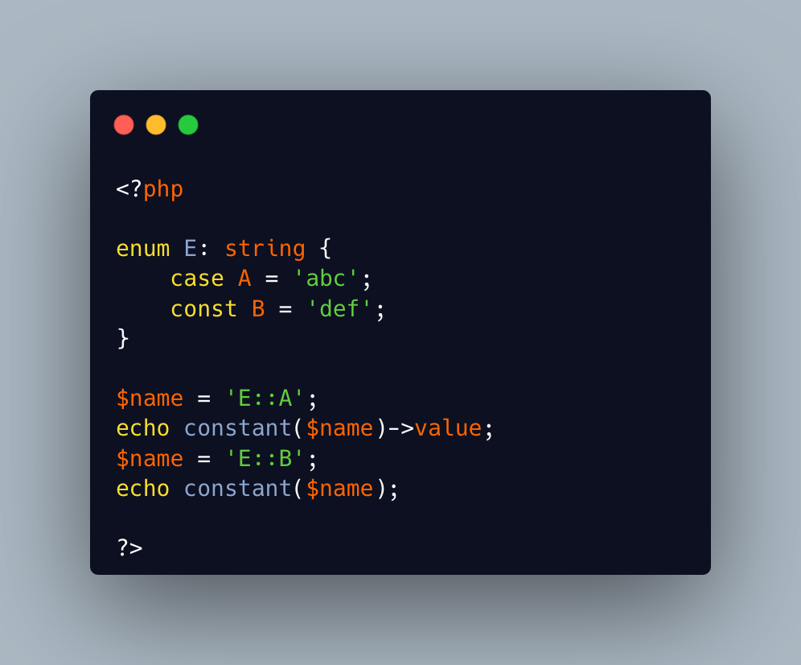

.. _dynamic-enum-cases:

Dynamic Enum Cases
------------------

.. meta::
	:description:
		Dynamic Enum Cases: PHP offers the ``constant()`` function to reach the value of a constant, when knowing its name.
	:twitter:card: summary_large_image
	:twitter:site: @exakat
	:twitter:title: Dynamic Enum Cases
	:twitter:description: Dynamic Enum Cases: PHP offers the ``constant()`` function to reach the value of a constant, when knowing its name
	:twitter:creator: @exakat
	:twitter:image:src: https://php-tips.readthedocs.io/en/latest/_images/dynamic_enum_cases.png
	:og:image: https://php-tips.readthedocs.io/en/latest/_images/dynamic_enum_cases.png
	:og:title: Dynamic Enum Cases
	:og:type: article
	:og:description: PHP offers the ``constant()`` function to reach the value of a constant, when knowing its name
	:og:url: https://php-tips.readthedocs.io/en/latest/tips/dynamic_enum_cases.html
	:og:locale: en

.. raw:: html

	

PHP offers the ``constant()`` function to reach the value of a constant, when knowing its name.

This also works for class constant, using the ``class::constant`` name. This is an alternative to the ``class::{$name}`` syntax, that was introduced in PHP 8.3.

And the ``constant()`` call also works on enumeration cases, which are, eventually, also class constants.

See Also
________

* `Dynamic Enum Cases <https://3v4l.org/lQY9A>`_ [Try me]

PHP Features
____________

* `enum <https://php-dictionary.readthedocs.io/en/latest/dictionary/enum.ini.html>`_

* `enum-case <https://php-dictionary.readthedocs.io/en/latest/dictionary/enum-case.ini.html>`_

* `constant <https://php-dictionary.readthedocs.io/en/latest/dictionary/constant.ini.html>`_

* `constant-function <https://php-dictionary.readthedocs.io/en/latest/dictionary/constant-function.ini.html>`_

* `class-constant-syntax <https://php-dictionary.readthedocs.io/en/latest/dictionary/class-constant-syntax.ini.html>`_

