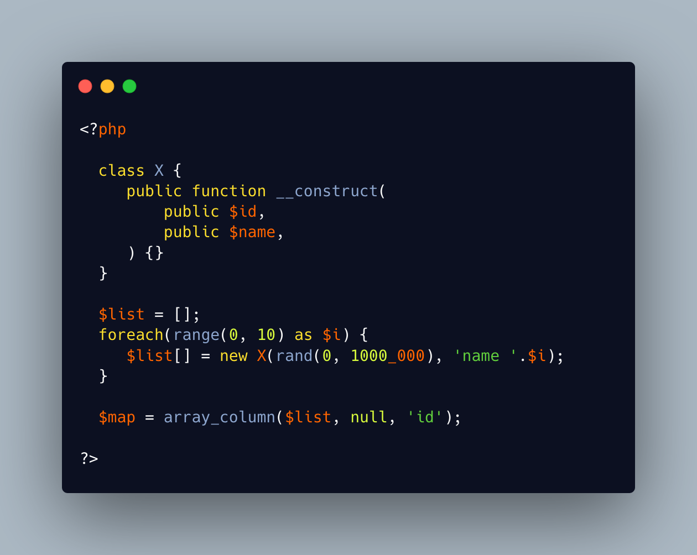

.. _easy-map:

Easy Map
--------

.. meta::
	:description:
		Easy Map: array_column() extracts a property or an index in an array of objects or arrays.
	:twitter:card: summary_large_image
	:twitter:site: @exakat
	:twitter:title: Easy Map
	:twitter:description: Easy Map: array_column() extracts a property or an index in an array of objects or arrays
	:twitter:creator: @exakat
	:twitter:image:src: https://php-tips.readthedocs.io/en/latest/_images/easy_map.png
	:og:image: https://php-tips.readthedocs.io/en/latest/_images/easy_map.png
	:og:title: Easy Map
	:og:type: article
	:og:description: array_column() extracts a property or an index in an array of objects or arrays
	:og:url: https://php-tips.readthedocs.io/en/latest/tips/easy_map.html
	:og:locale: en

.. raw:: html

	

array_column() extracts a property or an index in an array of objects or arrays. It also accepts ``null`` as second argument: this represents the original object or array, as a whole.

Combined with the third argument, it makes a convenient one-liner to build a map, based on a list of objects or arrays.

See Also
________

* `array_column (PHP manual) <https://www.php.net/manual/en/function.array-column.php>`_
* `Easy mapping <https://3v4l.org/F0CR0>`_ [Try me]

PHP Features
____________

* `array_column <https://php-dictionary.readthedocs.io/en/latest/dictionary/array_column.ini.html>`_

* `null <https://php-dictionary.readthedocs.io/en/latest/dictionary/null.ini.html>`_

