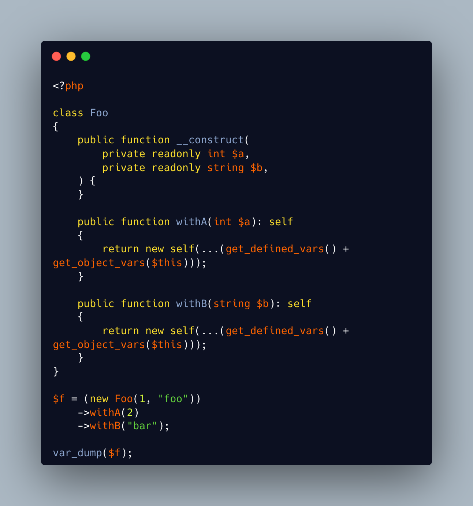

.. _easy-wither-call:

Easy Wither Call
----------------

.. meta::
	:description:
		Easy Wither Call: Can be useful to create "with-ers" in an immutable (value) object with a LOT of readonly properties.
	:twitter:card: summary_large_image
	:twitter:site: @exakat
	:twitter:title: Easy Wither Call
	:twitter:description: Easy Wither Call: Can be useful to create "with-ers" in an immutable (value) object with a LOT of readonly properties
	:twitter:creator: @exakat
	:twitter:image:src: https://php-tips.readthedocs.io/en/latest/_images/easy_wither.png
	:og:image: https://php-tips.readthedocs.io/en/latest/_images/easy_wither.png
	:og:title: Easy Wither Call
	:og:type: article
	:og:description: Can be useful to create "with-ers" in an immutable (value) object with a LOT of readonly properties
	:og:url: https://php-tips.readthedocs.io/en/latest/tips/easy_wither.html
	:og:locale: en

By `Benoit Viguier <https://phpc.social/@b_viguier>`_

Can be useful to create "with-ers" in an immutable (value) object with a LOT of readonly properties.

'+' is the addition of arrays, the first values have priority.

get_defined_vars() gets the local variables, with their name, unlike func_get_args().

Valid in PHP 8.1, with support for variadic and named keys.

* `Easy Wither code <https://3v4l.org/XhG90>`_
* `Original Tweet <https://twitter.com/b_viguier/status/1736328787741065295>`_
* `get_defined_vars <https://www.php.net/manual/en/function.get-defined-vars.php>`_
* `func_get_args <https://www.php.net/manual/en/function.func-get-args.php>`_

