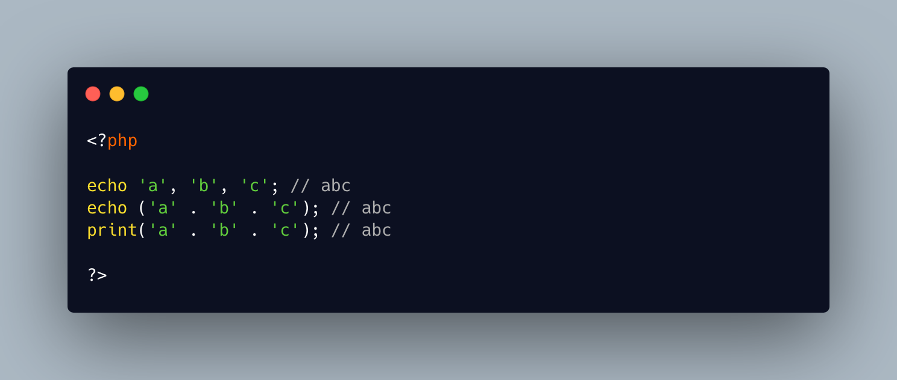

.. _call-echo-with-commas:

Call echo With Commas
---------------------

.. meta::
	:description:
		Call echo With Commas: The most efficient way to call echo is to use commas.
	:twitter:card: summary_large_image
	:twitter:site: @exakat
	:twitter:title: Call echo With Commas
	:twitter:description: Call echo With Commas: The most efficient way to call echo is to use commas
	:twitter:creator: @exakat
	:twitter:image:src: https://php-tips.readthedocs.io/en/latest/_images/echo-comma.png
	:og:image: https://php-tips.readthedocs.io/en/latest/_images/echo-comma.png
	:og:title: Call echo With Commas
	:og:type: article
	:og:description: The most efficient way to call echo is to use commas
	:og:url: https://php-tips.readthedocs.io/en/latest/tips/echo-comma.html
	:og:locale: en

.. raw:: html

	

The most efficient way to call echo is to use commas. Each argument of echo is then sed to the output. Echo is not a function, but a language construct, with this special ability.

echo is sometimes used with parenthesis: it makes it look like an actual function call. Yet, it also reduces the number of arguments from arbitrary to one: there can be only one element inside a parenthesis.

Hence, any list of several arguments passed to echo is concatenated into one. This is a useless concatenation, as it is immediately discarded. And echoing the arguments one after the other does the same job.

In the end, it is a micro-optimisation anyway.

See Also
________

* `echo and print <https://3v4l.org/qi4pp#veol>`_ [Try me]

PHP Features
____________

* `echo <https://php-dictionary.readthedocs.io/en/latest/dictionary/echo.ini.html>`_

* `concatenation <https://php-dictionary.readthedocs.io/en/latest/dictionary/concatenation.ini.html>`_

* `print <https://php-dictionary.readthedocs.io/en/latest/dictionary/print.ini.html>`_

* `micro-optimisation <https://php-dictionary.readthedocs.io/en/latest/dictionary/micro-optimisation.ini.html>`_

* `language-construct <https://php-dictionary.readthedocs.io/en/latest/dictionary/language-construct.ini.html>`_

