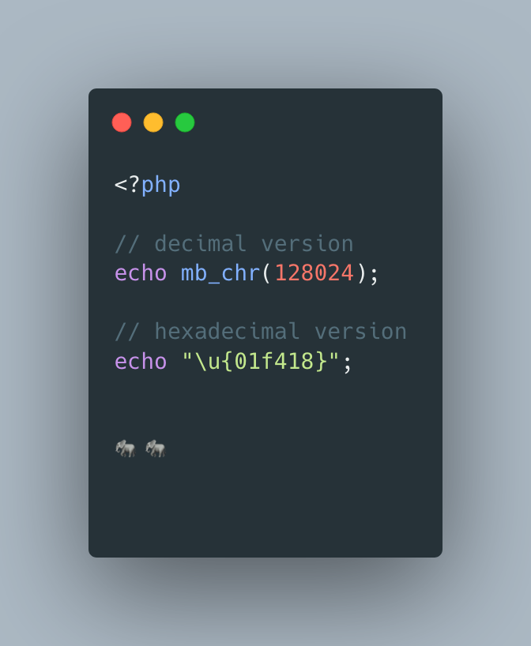

.. _an-elephpant-in-the-code:

An elephpant in the code
------------------------

When you need an elephant in your text, and you have PHP handy : 

its unicode is 128024 or 0x1F418.

* `Double quoted <https://www.php.net/manual/en/language.types.string.php#language.types.string.syntax.double>`_

