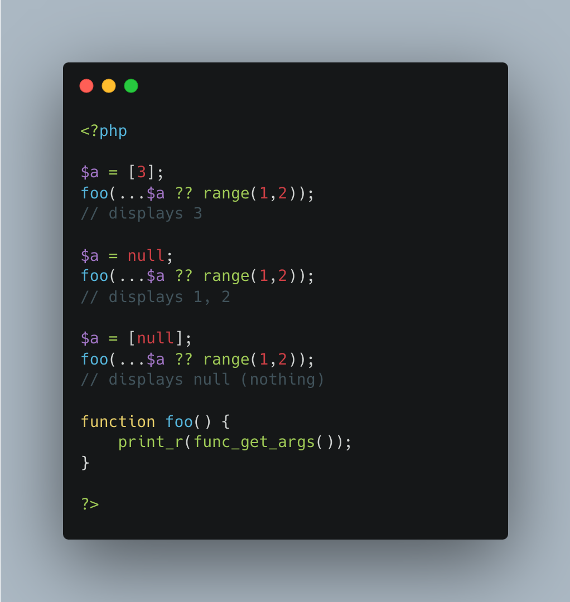

.. _ellipsis-and-coalesce:

Ellipsis And Coalesce
---------------------

.. meta::
	:description:
		Ellipsis And Coalesce: Ellipsis, aka ``.
	:twitter:card: summary_large_image
	:twitter:site: @exakat
	:twitter:title: Ellipsis And Coalesce
	:twitter:description: Ellipsis And Coalesce: Ellipsis, aka ``
	:twitter:creator: @exakat
	:twitter:image:src: https://php-tips.readthedocs.io/en/latest/_images/ellipsisAndCoalesce.png
	:og:image: https://php-tips.readthedocs.io/en/latest/_images/ellipsisAndCoalesce.png
	:og:title: Ellipsis And Coalesce
	:og:type: article
	:og:description: Ellipsis, aka ``
	:og:url: https://php-tips.readthedocs.io/en/latest/tips/ellipsisAndCoalesce.html
	:og:locale: en

.. raw:: html

	

Ellipsis, aka ``...`` three dots, applies only to arrays and Traversable objects. It also has a lower priority than the ``??`` coalesce operator, which means that ``??`` is applied before the ``...``.

This way, when the variable is undefined, it is still possible to unpack it, after having given a default value.

See Also
________

* `Array unpacking (PHP manual) <https://www.php.net/manual/en/language.types.array.php#language.types.array.unpackingp>`_
* `ellipsis and coalesce <https://3v4l.org/YTEL6>`_

