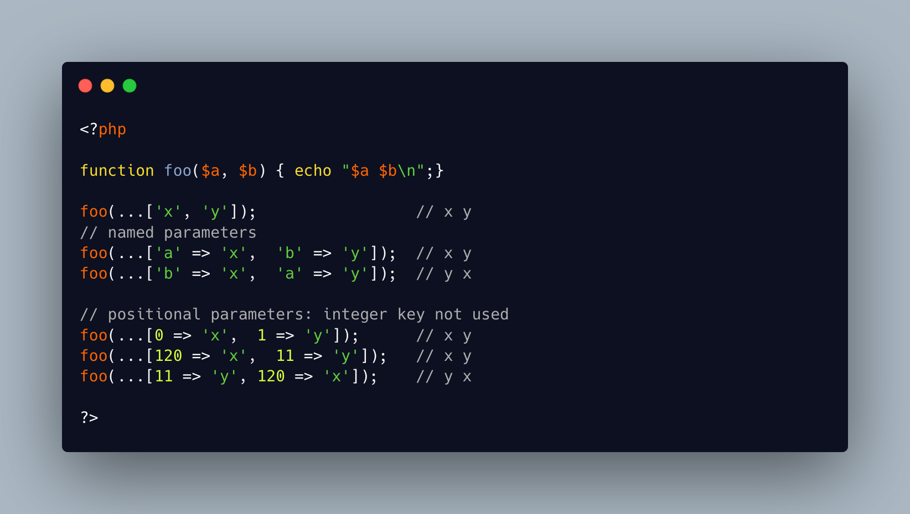

.. _ellipsis-with-array-parameters:

Ellipsis With Array Parameters
------------------------------

.. meta::
	:description:
		Ellipsis With Array Parameters: It is possible to spread parameters from an array, when calling a function.
	:twitter:card: summary_large_image
	:twitter:site: @exakat
	:twitter:title: Ellipsis With Array Parameters
	:twitter:description: Ellipsis With Array Parameters: It is possible to spread parameters from an array, when calling a function
	:twitter:creator: @exakat
	:twitter:image:src: https://php-tips.readthedocs.io/en/latest/_images/ellipsis_array_parameters.png
	:og:image: https://php-tips.readthedocs.io/en/latest/_images/ellipsis_array_parameters.png
	:og:title: Ellipsis With Array Parameters
	:og:type: article
	:og:description: It is possible to spread parameters from an array, when calling a function
	:og:url: https://php-tips.readthedocs.io/en/latest/tips/ellipsis_array_parameters.html
	:og:locale: en

.. raw:: html

	

It is possible to spread parameters from an array, when calling a function.

With string keys, the parameters are named and assigned their corresponding parameter.

With integer positions, the parameters are used depending of their position in the array, not their actual key.

It might require a call to ksort() or array_values() to make it clear.

See Also
________

* `Function parameters and arguments (PHP manual) <https://www.php.net/manual/en/functions.arguments.php>`_
* `ellipsis with arrays <https://3v4l.org/TbFHe>`_

