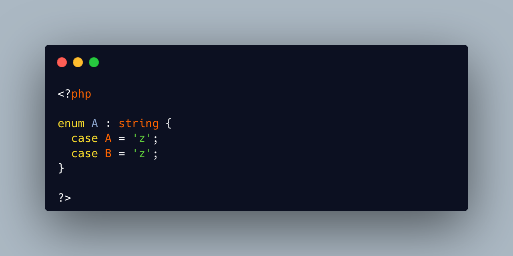

.. _enum-are-not-linted:

Enum Are Not Linted
-------------------

.. meta::
	:description:
		Enum Are Not Linted: It is possible to give two identical values to different enumeration cases, but not to execute it.

It is possible to give two identical values to different enumeration cases, but not to execute it.

In PHP 8.1, duplicate case values generated a compilation error.

Since PHP 8.2, it is now waiting for the execution stage and the first usage of the enumeration, to raise a fatal error.

* `Enumeration <https://www.php.net/manual/en/language.types.enumerations.php>`_

