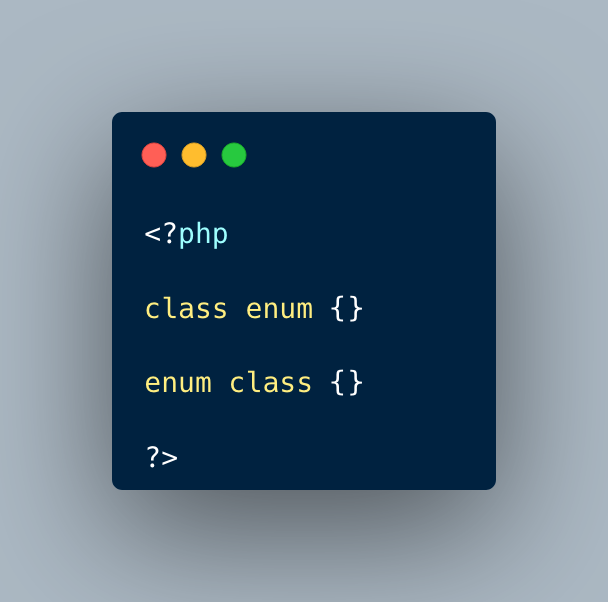

.. _enum-as-a-name:

Enum As A Name
--------------

.. meta::
	:description:
		Enum As A Name: It is possible to name a class enum, but not to name an enum class.
	:twitter:card: summary_large_image
	:twitter:site: @exakat
	:twitter:title: Enum As A Name
	:twitter:description: Enum As A Name: It is possible to name a class enum, but not to name an enum class
	:twitter:creator: @exakat
	:twitter:image:src: https://php-tips.readthedocs.io/en/latest/_images/enum_as_name.png
	:og:image: https://php-tips.readthedocs.io/en/latest/_images/enum_as_name.png
	:og:title: Enum As A Name
	:og:type: article
	:og:description: It is possible to name a class enum, but not to name an enum class
	:og:url: https://php-tips.readthedocs.io/en/latest/tips/enum_as_name.html
	:og:locale: en

.. raw:: html

	

It is possible to name a class enum, but not to name an enum class. In fact, 'enum' is an authorized name for interfaces and traits, to help with backward compatibility.

This also means that an enumeration may be called 'enum'.

See Also
________

* `Example (PHP manual) <https://3v4l.org/bojkm>`_

