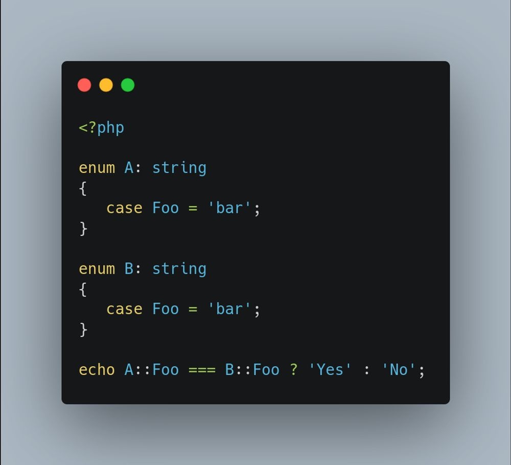

.. _enumeration's-cases-comparisons:

Enumeration's Cases Comparisons
-------------------------------

.. meta::
	:description:
		Enumeration's Cases Comparisons: Enumeration cases are different when the enumeration are different, not when the value of the case is different.
	:twitter:card: summary_large_image
	:twitter:site: @exakat
	:twitter:title: Enumeration's Cases Comparisons
	:twitter:description: Enumeration's Cases Comparisons: Enumeration cases are different when the enumeration are different, not when the value of the case is different
	:twitter:creator: @exakat
	:twitter:image:src: https://php-tips.readthedocs.io/en/latest/_images/enum_case_comparisons.png.png
	:og:image: https://php-tips.readthedocs.io/en/latest/_images/enum_case_comparisons.png
	:og:title: Enumeration's Cases Comparisons
	:og:type: article
	:og:description: Enumeration cases are different when the enumeration are different, not when the value of the case is different
	:og:url: https://php-tips.readthedocs.io/en/latest/tips/enum_case_comparisons.html
	:og:locale: en

By `Frederic Bouchery <https://bsky.app/profile/bouchery.fr>`_

Enumeration cases are different when the enumeration are different, not when the value of the case is different. It is a difference with using constants for enumerations.

To compare their value, the comparison must be done with the 'value' property, not the object.

* `Backed enumeration (PHP manual) <https://www.php.net/manual/en/language.enumerations.backed.php>`_

